# GBD · Ejercicios E/R 2 · Reflexivas, débiles, ternarias y jerarquías

Siete ejercicios que se resuelven en clase, en la pizarra, entre todos. Cada uno practica un
elemento del E/R que faltaba. La teoría está en
[`teoria-2-er-y-relacional.md`](teoria-2-er-y-relacional.md), apartados 3 a 5.

| # | Dominio | Qué practica |
|---|---|---|
| P1 | Empleados y jefes | Reflexiva 1:N |
| P2 | Módulos que son requisito de otros | Reflexiva N:M |
| P3 | Departamentos y jefatura | 1:1 y dos relaciones entre las mismas entidades |
| P4 | Edificios y aulas | Entidad débil |
| P5 | Ficha de cliente | Atributo compuesto, multivaluado, derivado, opcional |
| P6 | Quién da qué a quién | Ternaria |
| P7 | Componentes del almacén | Jerarquía |

Después vienen los ejercicios de equipo, uno por equipo, en
[`ejercicios-er-3-equipos/`](ejercicios-er-3-equipos/).

---

Se resuelven en la pizarra, entre todos. Primero el enunciado y un minuto para pensarlo; luego la
solución, que está debajo de cada uno: el diagrama E/R y las tablas, en texto y dibujadas como en
DrawDB (pata de gallo). Tomad apuntes: son el modelo para los ejercicios de equipo.

En los diagramas E/R de abajo, 🔑 marca la clave (en papel, subrayada); la entidad débil tiene
doble borde, la relación identificadora es un hexágono y la jerarquía un trapecio.

## P1 · Empleados y jefes · reflexiva 1:N

> En una empresa cada empleado tiene como mucho un jefe directo, que es otro empleado. Un jefe
> puede tener a varios empleados a su cargo. La directora general no tiene jefe.

¿Cómo sabemos quién es el jefe del jefe de alguien?

### Solución

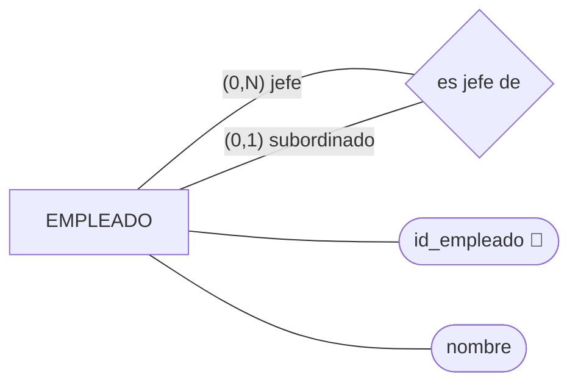

```text
EMPLEADO(id_empleado PK, nombre, id_jefe? FK → EMPLEADO)
```

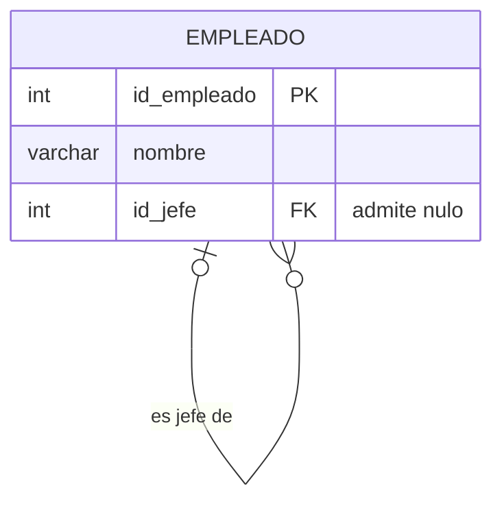

| Decisión | Por qué |
|---|---|
| Una sola entidad, con la relación volviendo a ella | El jefe también es empleado: tiene nombre, y su propio jefe. Una entidad JEFE aparte repetiría a las personas |
| Cardinalidad por papeles | Como jefe, un empleado dirige a `(0,N)`; como subordinado, tiene `(0,1)` jefes |
| `id_jefe` en la misma tabla | Regla 7. Es una 1:N: la clave ajena va en el lado del subordinado |
| `id_jefe` admite nulo | La directora |
| Se llama `id_jefe` | El nombre dice el papel, no la tabla |

**Jefe del jefe:** se busca la fila del empleado, se coge su `id_jefe`, se busca esa fila y se coge
su `id_jefe`. La misma tabla, dos veces.

**No cabe en el diseño:** nadie es su propio jefe (se puede poner un `CHECK`); no hay ciclos
(A jefe de B, B jefe de A): eso no.

## P2 · Módulos que son requisito de otros · reflexiva N:M

> Para cursar algunos módulos hay que haber aprobado otros antes. Un módulo puede exigir varios
> módulos previos, y un módulo puede ser requisito de varios.

Variante: en una red social, un usuario *sigue a* otros, y se guarda desde qué fecha. ¿Y si fuera
*es amigo de*, que va en los dos sentidos?

### Solución

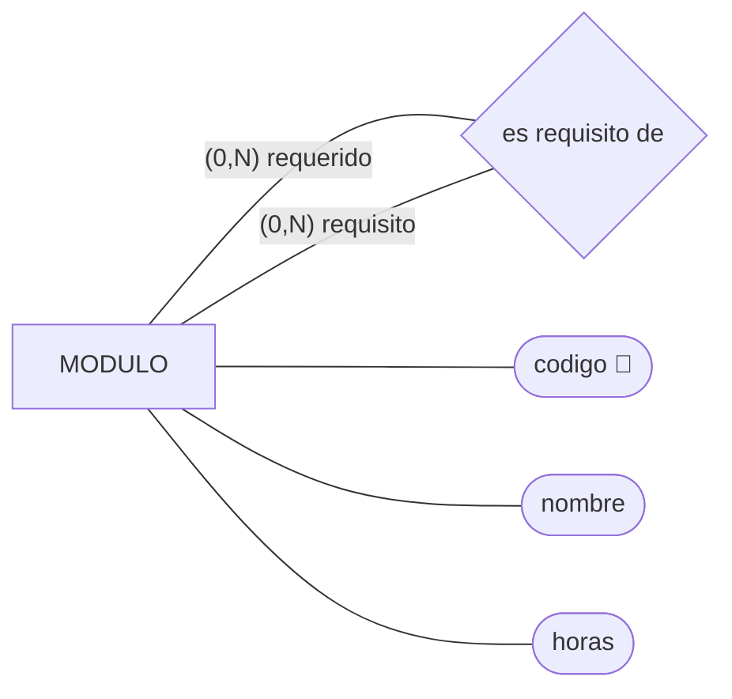

```text
MODULO(codigo PK, nombre, horas)
REQUISITO(codigo_modulo FK → MODULO, codigo_requisito FK → MODULO)
          PK(codigo_modulo, codigo_requisito)
```

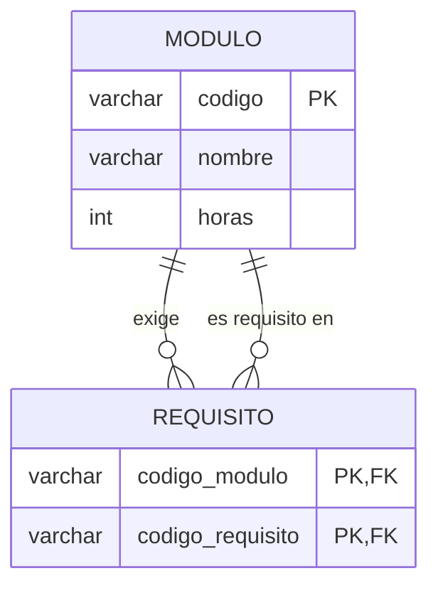

| Decisión | Por qué |
|---|---|
| Tabla REQUISITO | Regla 8. Es N:M: no cabe en una columna de MODULO |
| Dos claves ajenas a la misma tabla | Una por papel, con su nombre |
| La pareja es la clave primaria | Un módulo no exige dos veces el mismo requisito |

Una fila se lee así: `('0377', '0372')` = «para cursar ASGBD hace falta GBD».

**Sigue a:** igual, con la fecha en la tabla:
`SIGUE(id_seguidor FK → USUARIO, id_seguido FK → USUARIO, fecha_desde) PK(id_seguidor, id_seguido)`.
Que A siga a B no dice nada de B.

**Es amigo de:** va en los dos sentidos. O se guarda dos veces, (A,B) y (B,A), o una sola con la
regla «el número menor va primero». Las dos se defienden.

**No cabe en el diseño:** un módulo no es requisito de sí mismo (`CHECK`); sin ciclos.

## P3 · Departamentos y jefatura · 1:1 y dos relaciones

> Cada profesor pertenece a un departamento. Cada departamento tiene un jefe, que es uno de sus
> profesores, y un profesor puede ser jefe como mucho de un departamento.

¿En qué tabla va la clave ajena de la jefatura? ¿Qué pasa al dar de alta el primer departamento?

### Solución

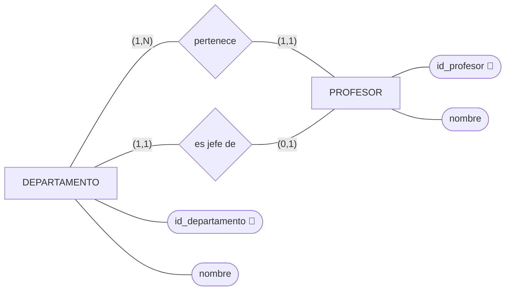

```text
DEPARTAMENTO(id_departamento PK, nombre, id_jefe? FK → PROFESOR)   UK(nombre) UK(id_jefe)
PROFESOR(id_profesor PK, nombre, id_departamento FK → DEPARTAMENTO)
```

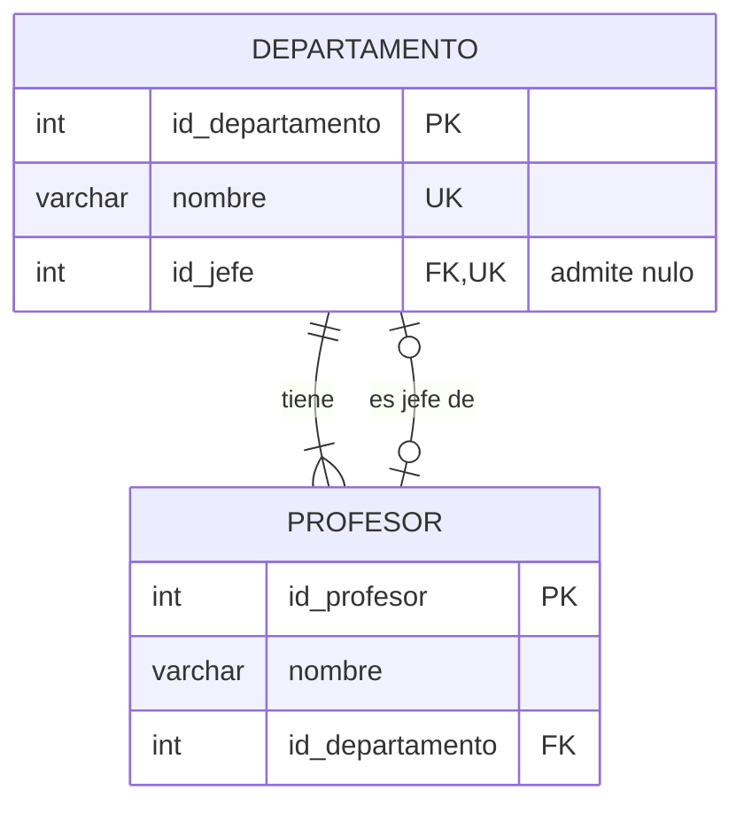

| Decisión | Por qué |
|---|---|
| Dos relaciones entre las mismas entidades | Pertenecer y dirigir son hechos distintos (regla 6) |
| La clave ajena de la jefatura en DEPARTAMENTO | Regla 4: en el lado obligatorio. Todo departamento tiene jefe; casi ningún profesor lo es. En PROFESOR sería una columna casi siempre vacía |
| `UK(id_jefe)` | Es lo que la hace 1:1: dos departamentos no pueden tener el mismo jefe |
| `id_jefe` admite nulo aunque el E/R diga `(1,1)` | El huevo y la gallina: el departamento necesita un jefe, y el jefe necesita estar en un departamento. Se crea el departamento sin jefe, luego el profesor, y luego se asigna |

**No cabe en el diseño:** el jefe de un departamento es de ese departamento. La clave ajena
comprueba que el profesor existe, no de qué departamento es. Y el `(1,1)` de la jefatura.

## P4 · Edificios y aulas · entidad débil

> El instituto tiene varios edificios, identificados por una letra (A, B, C). Las aulas se numeran
> dentro de cada edificio: hay un aula 12 en el A y otra en el B. De cada aula interesa la
> capacidad y si tiene proyector.

¿Y si cada aula tuviera un código único en todo el centro (`A12`, `B12`)? ¿Seguiría siendo débil?

### Solución

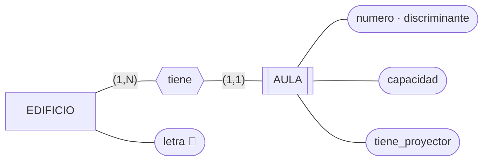

```text
EDIFICIO(letra PK)
AULA(letra_edificio FK → EDIFICIO, numero, capacidad, tiene_proyector)
     PK(letra_edificio, numero)
```

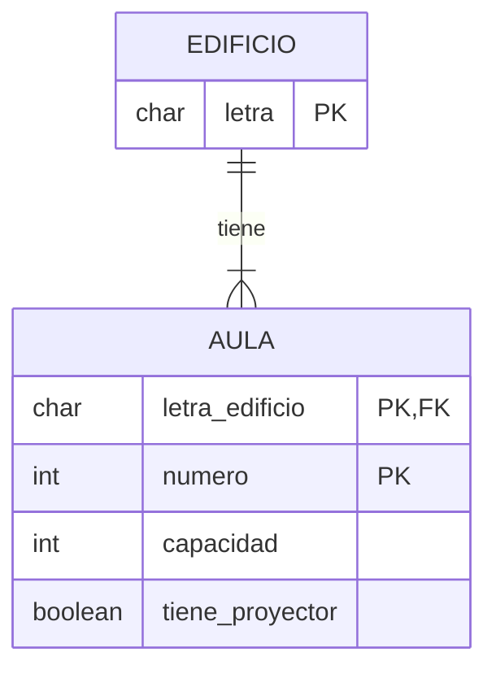

| Decisión | Por qué |
|---|---|
| AULA es débil | «Aula 12» no dice nada sin el edificio. `numero` es el discriminante |
| Clave primaria compuesta | Regla 5: la clave de la fuerte más el discriminante. `letra_edificio` es a la vez parte de la clave y clave ajena |
| Borrado en cascada | Si desaparece el edificio, desaparecen sus aulas. Es el caso en que `CASCADE` tiene sentido |

**Con código único (`A12`):** el aula se identifica sola, y deja de ser débil. Sigue sin poder
existir sin edificio, pero eso ya lo dice el `(1,1)`: la clave ajena es obligatoria y ya está.

```text
AULA(codigo PK, capacidad, tiene_proyector, letra_edificio FK → EDIFICIO)
```

**En vuestro reto:** la revisión 1, 2, 3 de un componente es exactamente esto.

## P5 · Ficha de cliente · tipos de atributo

> De cada cliente: DNI, nombre, dirección (calle, número, código postal y ciudad), uno o varios
> teléfonos, fecha de nacimiento, edad y, si quiere darlo, email.

¿Qué tipo de dato le ponéis al código postal? ¿Y al teléfono?

### Solución

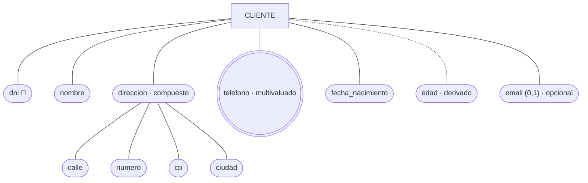

```text
CLIENTE(dni PK, nombre, calle, numero, cp, ciudad, fecha_nacimiento, email?)
TELEFONO_CLIENTE(dni FK → CLIENTE, telefono)   PK(dni, telefono)
```

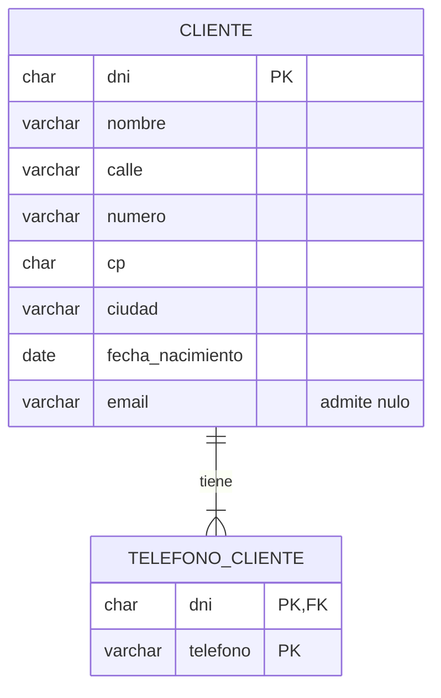

| Atributo | Tipo de atributo | En tablas |
|---|---|---|
| dirección | Compuesto | Una columna por componente. «Dirección» como tal desaparece |
| teléfonos | Multivaluado | Tabla propia (regla 10) |
| edad | Derivado | No se guarda: cambiaría sola cada cumpleaños |
| email | Opcional | Admite nulo |

**Tipos:** el código postal y el teléfono son **texto**. `08001` perdería el cero siendo número;
un teléfono lleva `+34` y espacios; y ninguno de los dos se suma. Es lo de la S1V: cosas que
parecen números y no lo son.

**Lo que no:** `telefono1`, `telefono2`, `telefono3`. ¿Y el que tiene cuatro? ¿Y para saber de quién
es un número, hay que mirar tres columnas?

## P6 · Quién da qué a quién · ternaria

> Un profesor imparte módulos a grupos. Un profesor da varios módulos y a varios grupos; un mismo
> módulo lo dan profesores distintos en grupos distintos; pero en un grupo, cada módulo lo da un
> solo profesor. Se guarda cuántas horas a la semana.

¿Por qué no bastan tres relaciones binarias?

### Solución

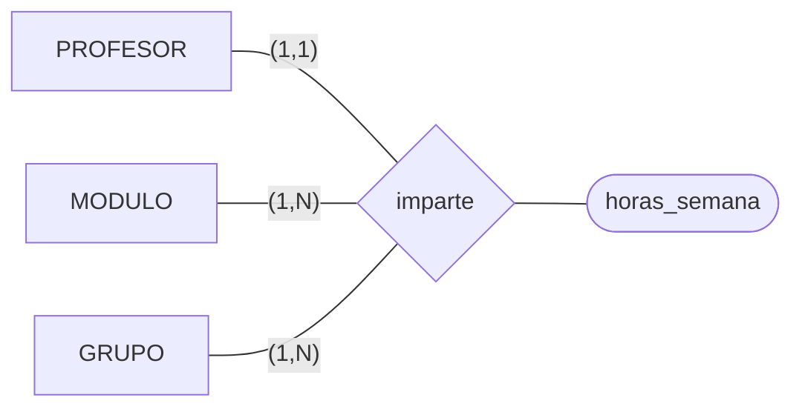

Cardinalidad de una ternaria: se **fijan dos** y se pregunta por la tercera.

| Fijo | Pregunto | Respuesta | Se escribe junto a |
|---|---|---|---|
| un módulo y un grupo | ¿cuántos profesores? | uno | PROFESOR `(1,1)` |
| un profesor y un grupo | ¿cuántos módulos? | varios | MODULO `(1,N)` |
| un profesor y un módulo | ¿cuántos grupos? | varios | GRUPO `(1,N)` |

```text
PROFESOR(id_profesor PK, nombre)
MODULO(codigo PK, nombre)
GRUPO(id_grupo PK, nombre)
IMPARTE(id_profesor FK → PROFESOR, codigo_modulo FK → MODULO, id_grupo FK → GRUPO, horas_semana)
        PK(codigo_modulo, id_grupo)
```

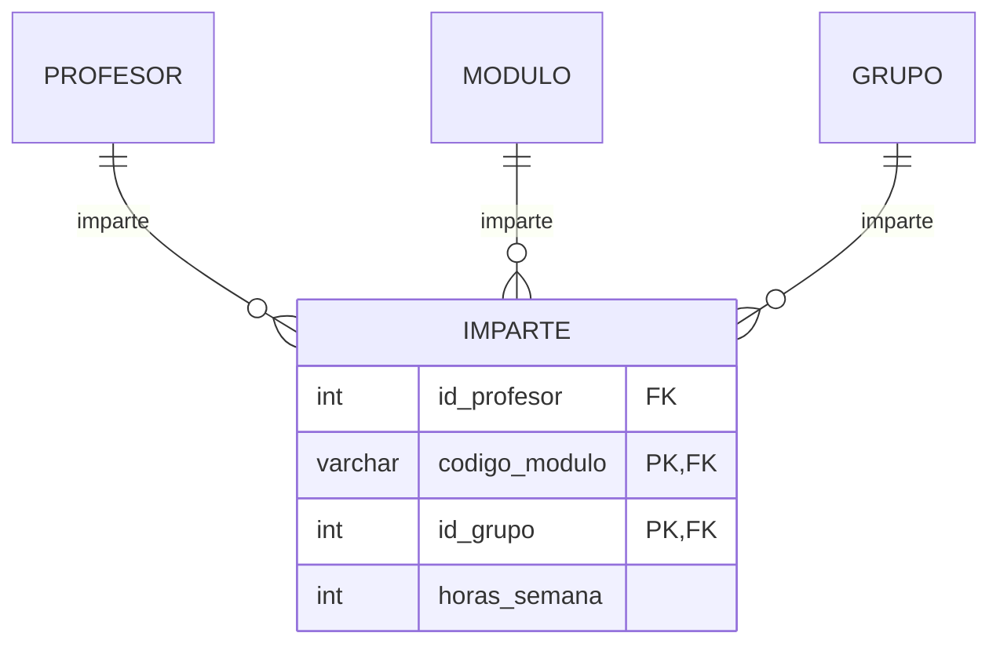

| Decisión | Por qué |
|---|---|
| Una tabla con tres claves ajenas | Regla 9 |
| El profesor fuera de la clave primaria | Tiene máximo 1: con el módulo y el grupo ya se sabe quién es. Si estuviera dentro, el gestor dejaría meter dos profesores de GBD en 1A, que es lo que el enunciado prohíbe |

**Tres binarias no bastan.** Ana da BD y Redes; Ana da clase en 1A y en 1B; BD se da en 1A y en
1B. ¿Da Ana Redes en 1A? Con tres relaciones de dos no se sabe. La ternaria guarda el trío.

## P7 · Componentes del almacén · jerarquía

> De todos los componentes del almacén guardamos número de serie (si lo tiene), fabricante y
> estado. De los módulos de RAM, además, capacidad y tipo de memoria; de los discos, capacidad y
> tecnología (HDD o SSD); de las CPU, núcleos y frecuencia. Todo componente es de uno de esos tres
> tipos, y solo de uno.

Es vuestro inventario. ¿Cómo lo pasaríais a tablas?

### Solución

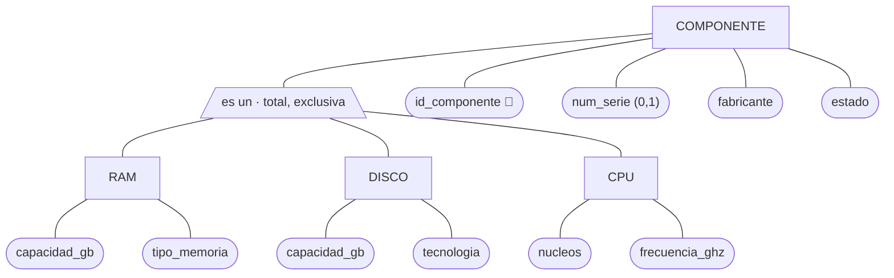

**Total:** no hay componentes que no sean de ningún tipo. **Exclusiva:** ninguno es de dos.

Tres formas de pasarlo a tablas (regla 11):

| Opción | Tablas | Pega |
|---|---|---|
| A · Una tabla | `COMPONENTE(id PK, num_serie?, fabricante, estado, tipo, capacidad_gb?, tipo_memoria?, tecnologia?, nucleos?, frecuencia_ghz?)` | Muchos nulos, y nada impide una RAM con núcleos o sin capacidad |
| **B · Supertipo y subtipos** | La de abajo | Para ver una RAM entera hay que juntar dos tablas |
| C · Solo subtipos | `RAM(id PK, num_serie?, fabricante, estado, capacidad_gb, tipo_memoria)`, igual DISCO y CPU | Lo común se repite; «todos los averiados» son tres consultas; «montado en» habría que ponerlo tres veces |

Para el reto, **B**:

```text
COMPONENTE(id_componente PK, num_serie?, fabricante, estado, tipo)   UK(num_serie)
RAM(id_componente PK FK → COMPONENTE, capacidad_gb, tipo_memoria)
DISCO(id_componente PK FK → COMPONENTE, capacidad_gb, tecnologia)
CPU(id_componente PK FK → COMPONENTE, nucleos, frecuencia_ghz)
```

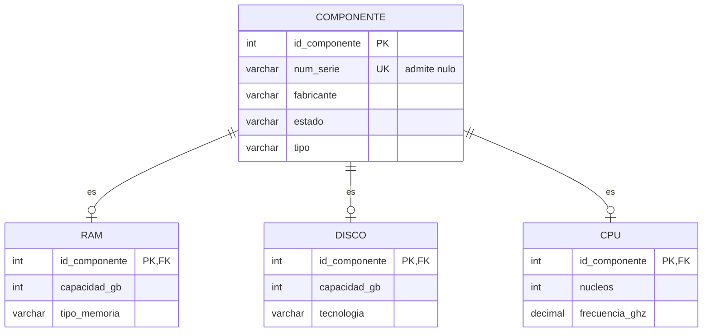

| Decisión | Por qué |
|---|---|
| B | «Montado en equipo», «procede de» y «revisado» son de todos los componentes: una sola clave ajena hacia COMPONENTE. La pregunta 7 del reto sale de una tabla |
| La clave del subtipo es a la vez clave ajena | Es una 1:1 con el supertipo |
| `capacidad_gb` no sube a COMPONENTE | Está en RAM y en DISCO, pero la CPU no tiene |
| `num_serie` no es la clave | Puede faltar. Va como alternativa (UK) |
| `fabricante` como texto | Para no distraer aquí. En vuestro reto es entidad: el almacén de la S1V |

**No cabe en el diseño:** que sea exclusiva (el mismo `id_componente` en RAM y en DISCO) y total
(todo componente en algún subtipo), y que `tipo` coincida con la tabla del subtipo.

---

Última actualización: 25 de septiembre de 2026.
