# GBD · Teoría 1 · Introducción a las bases de datos

Resumen en español de la Unidad 1 del material *Gestió de bases de dades* (CFGS ASX, M02,
Institut Obert de Catalunya, licencia CC BY-NC-SA). El PDF original lo tiene el profesor.

Es el documento de estudio del **RA1**: sigue la estructura del original, en versión corta y con
los ejemplos en forma de diagrama, y añade lo que aquel material —de 2011— no cubre y el currículo
sí exige: CSV y codificación, organización de ficheros, NoSQL, ubicación del gestor y clasificación
de gestores actuales. Al final hay un [glosario](#glosario), una
[autoevaluación](#autoevaluación) con respuestas y un
[anexo de tipos de datos](#anexo--tipos-de-datos).

Los apartados 4.5 y 5.3 a 5.7 van más allá de lo exigible en el RA1: se
incluyen porque completan el tema, no porque entren en la prueba.

| Apartado | Contenido | RA |
|---|---|---|
| [1](#1-los-datos-y-las-bases-de-datos) | Datos, entidades, atributos, claves, ficheros, CSV | RA1.a, RA2 |
| [2](#2-ficheros-y-bases-de-datos) | Origen de las BD, comparativa, organización, acceso, niveles de abstracción | RA1.a, RA1.d |
| [3](#3-los-sgbd) | Evolución, objetivos, lenguajes, usuarios, componentes, diccionario | RA1.d, RA1.e |
| [4](#4-modelos-de-bases-de-datos) | ANSI/SPARC, jerárquico, red, relacional, objetos, NoSQL | RA1.b |
| [5](#5-ubicación-de-las-bases-de-datos) | Embebida, servidor, nube; centralizada y distribuida | RA1.c |
| [6](#6-clasificación-de-los-sgbd) | Criterios de clasificación de un gestor | RA1.f |

**Para ampliar**, en el PDF del IOC (unidad 1, en catalán):

| Apartado de este tema | IOC, unidad 1 | Páginas |
|---|---|---|
| 1 · Los datos y las bases de datos | 1.1 *Les dades i les bases de dades* | 19–28 |
| 2 · Ficheros y bases de datos | 1.2 *Conceptes de fitxers i bases de dades* | 29–35 |
| 3 · Los SGBD | 1.3 *Els SGBD* | 36–54 |
| 4 · Modelos de bases de datos | 2.1 y 2.2 *Arquitectura dels SGBD*, *Els models de bases de dades més comuns* | 55–64 |
| 5 · Ubicación | 2.3 *Bases de dades distribuïdes* | 65–82 |
| 6 · Clasificación | No está en el IOC, que es de 2011: son los gestores actuales | — |

---

## 1. Los datos y las bases de datos

### 1.1 Los tres mundos

Trabajar con datos exige distinguir tres ámbitos:

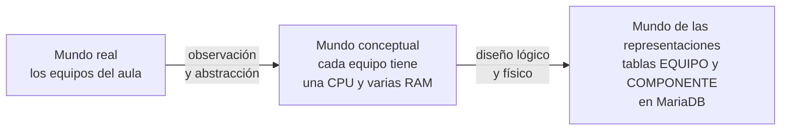

Un mismo mundo real da lugar a mundos conceptuales distintos según qué interese al observador, y
cada mundo conceptual admite varias representaciones. No todas son equivalentes: las decisiones de
diseño y la tecnología elegida cambian la eficiencia del resultado.

### 1.2 Entidades, atributos y valores

| Elemento | Qué es | Ejemplo |
|---|---|---|
| Entidad | Objeto del mundo real que conceptualizamos, distinguible de los demás | El equipo `EQ-04` |
| Atributo | Propiedad de la entidad que nos interesa | `num_serie`, `estado`, `ram_total` |
| Valor | Contenido concreto del atributo | `SN-7781`, `arranca`, `8` |

Con solo dos de los tres no hay información: `8` sin saber de qué equipo ni de qué propiedad no
dice nada.

Un atributo debe guardar **un solo valor** en cada instante. Los atributos multivaluados
(una lista dentro de una celda) son incompatibles con el modelo relacional.

### 1.3 Entidad tipo y entidad instancia

- **Entidad tipo**: la clase genérica — los equipos, en general.
- **Entidad instancia**: un objeto concreto — el equipo `EQ-04`.

En términos de conjuntos, la entidad tipo es el conjunto y cada instancia un elemento.

### 1.4 Tipo de dato y dominio

- **Tipo de dato**: conjunto de valores con características comunes y con unas operaciones
  admisibles. Los enteros admiten la división entera, no la exacta.
- **Dominio**: conjunto de valores válidos para un atributo concreto. No define operaciones, y en
  la práctica es un subconjunto de un tipo de dato.

Ejemplo: `ram_gb` es de tipo entero, pero su dominio son los valores `1, 2, 4, 8, 16, 32`.

### 1.5 Valor nulo

El valor nulo indica **ausencia de valor**: desconocido o inexistente. Se admite o no al definir el
dominio del atributo.

No es el cero ni la cadena vacía, que son valores con significado propio. `ram_gb = 0` significa
«no tiene RAM»; `ram_gb = NULL` significa «no sabemos cuánta tiene».

### 1.6 Atributos identificadores y claves

- **Atributo identificador**: su valor es único y no se repite entre instancias.
- **Clave**: todo atributo o conjunto de atributos que identifica inequívocamente las instancias.

Todo identificador es clave, pero una clave puede necesitar varios atributos. Que un atributo sirva
de identificador depende de qué modele la entidad:

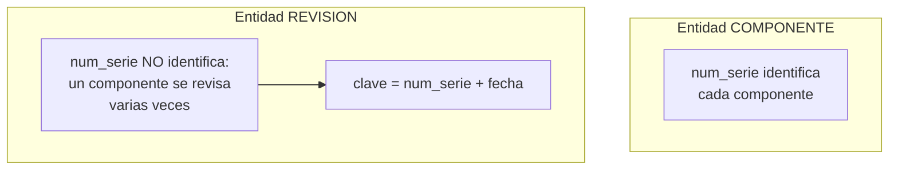

Ni los identificadores ni los atributos que forman parte de una clave admiten nunca el valor nulo.

### 1.7 Representación tabular y ficheros

La representación habitual en bases de datos es la **tabla**: cada fila es una entidad instancia,
cada columna un atributo, cada celda un valor.

Su implementación informática es el **fichero de datos**: la fila se llama **registro** y la
columna, **campo**. Se guarda en memoria externa (disco) porque la interna es volátil.

Añadir instancias o atributos solo añade filas o columnas: la estructura no se complica.

### 1.8 Ficheros de texto y ficheros binarios

| | Texto | Binario |
|---|---|---|
| Qué contiene | Caracteres legibles, línea a línea | Bytes con el formato que decida el programa |
| Cómo se abre | Con cualquier editor (`nano`, Bloc de notas, VS Code) | Solo con el programa que lo entiende |
| Ejemplos | `.csv`, `.txt`, `.json`, `.xml`, `.sql`, `.html` | `.xlsx`, `.ods`, `.jpg`, `.pdf`, ficheros internos de una base de datos |
| Ventaja | Lo lee cualquiera, en cualquier sistema, dentro de 30 años | Ocupa menos, se procesa más rápido, guarda formato |
| Problema | La codificación: una `ñ` guardada en Windows-1252 sale como `ñ` si se lee como UTF-8 | Si el programa desaparece, el fichero no se puede leer |

Un `.xlsx` o un `.ods` es en realidad un `.zip` con ficheros XML dentro: es binario para el
usuario, aunque por dentro haya texto.

**CSV** (*comma-separated values*) es texto plano con un registro por línea y los campos separados
por un carácter. Lo entienden a la vez una hoja de cálculo, un gestor de bases de datos y un
script, y por eso es el formato de intercambio habitual.

```text
Equipo;Aula;Grupo;Placa;RAM;Obs.
EQ-01;1.12;G1;Asus P8H61-M LX;2x4GB DDR3 Kingston;
EQ-02;1.12;G1;Asus P8H61-M LX;"4GB DDR3 kingston; 2GB Samsung";ranura 3 rota
EQ-03;1.12;Grupo 2;ASUS P8H61-MLX;4096MB DDR3 KINGSTON;no arranca
```

| Elemento | Qué es | Qué falla si no se respeta |
|---|---|---|
| Cabecera | Primera línea, con los nombres de los campos | Sin ella, nadie sabe qué es cada columna |
| Separador | El carácter entre campos. `,` en inglés; `;` en español, porque la coma es el separador decimal | Un `3,2 GHz` con separador `,` parte el campo en dos |
| Comillas | Encierran un campo que contiene el separador | Sin comillas, `4GB DDR3 kingston; 2GB Samsung` se convierte en dos campos y descuadra la fila |
| Codificación | UTF-8 casi siempre | Tildes y eñes rotas al abrirlo en otro sistema: `Pérez` leído con la codificación equivocada sale `Pérez` |
| Comillas dentro de un campo | Se escriben dobles: `"monitor de 24"" pulgadas"` | El campo se corta donde no debe |
| BOM | Unos bytes invisibles que Excel pone al principio de un CSV en UTF-8 | Otro programa los lee como parte del nombre de la primera columna |
| Fin de línea | Windows usa dos caracteres (CR LF); Linux, uno (LF) | Aparece un carácter raro al final del último campo de cada fila |

Estas reglas están recogidas en un estándar, el RFC 4180, aunque cada programa las cumple a su
manera.

Lo que el CSV **no** tiene: tipos de datos (todo es texto), reglas (nada impide escribir `Grupo 2`
donde otros escriben `G2`) ni relación con otros ficheros.

### 1.9 Las BD: ficheros interrelacionados

Normalmente hay varias entidades tipo, y las tablas que las representan no son independientes. Las
**interrelaciones** asocian entidades entre sí, mediante campos del mismo tipo que almacenan los
mismos valores.

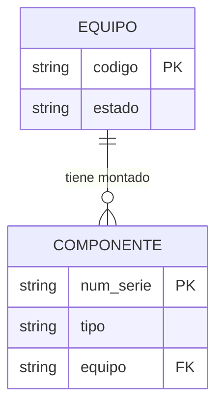

> Una BD es un conjunto de ficheros de datos interrelacionados.

Mantener esa coherencia a mano es costoso: si cambia o se borra un valor que sirve de enlace, hay
que reflejarlo en todos los ficheros implicados. De ahí los SGBD.

### 1.10 Nivel lógico y nivel físico

| Nivel | Con qué se trabaja | Cuándo |
|---|---|---|
| Lógico | Tablas, campos, registros, interrelaciones | Siempre que se pueda: es lo más productivo |
| Físico | Encadenamiento de registros, compresión, tipos de índice | Solo cuando hace falta optimizar |

---

## 2. Ficheros y bases de datos

### 2.1 De dónde vienen las BD


Cada aplicación nueva copiaba en un fichero propio los datos que ya existían en otro. Eso
simplificaba el programa, pero producía **redundancia** y con ella riesgo de incoherencia.

> Una BD es la representación informática de conjuntos de entidades instancia de distintas
> entidades tipo y de las relaciones entre ellas, utilizable de forma compartida y simultánea por
> varios usuarios.

### 2.2 Ficheros frente a bases de datos

| Aspecto | Ficheros | Bases de datos |
|---|---|---|
| Entidades tipo | Una por fichero | Muchas, interrelacionadas |
| Interrelaciones | El sistema no las conoce | El sistema tiene herramientas para ellas |
| Redundancia | Un fichero a medida por aplicación | Todas las aplicaciones sobre la misma BD |
| Inconsistencias | Posibles si el programador no actualiza todas las copias | El dato se guarda una sola vez |
| Obtener datos | Programa a medida, compilar y ejecutar | Consulta directa, sin programar |
| Integridad | La implementa cada programa | La implementa el gestor |
| Atomicidad | Muy difícil de garantizar | Transacciones |
| Concurrencia | La actualización simultánea provoca inconsistencia | Bloqueos |
| Seguridad | Un fichero, una visión, todo o nada | Vistas y permisos por usuario |

Los ficheros siguen siendo la opción razonable cuando el volumen es pequeño o no hay
interrelaciones: ficheros de configuración de aplicaciones y de sistemas, y registros de
eventos (*logs*). Montar un SGBD ahí solo empeoraría el rendimiento.

#### Los problemas de una hoja, con su nombre

Lo que se encontró en la hoja de inventario del aula tiene nombre técnico:

| Problema | Nombre | En la hoja del aula |
|---|---|---|
| Una celda con más de un valor | **Valor no atómico** | `2x4GB DDR3 Kingston`; `WD 1TB, Kingston SSD 240` |
| El mismo dato escrito de varias formas | **Sin control de dominio**: nada limita los valores válidos | `Kingston`, `kingston`, `KINGSTON` |
| Un mismo hecho repetido en muchas filas: al cambiarlo hay que cambiarlas todas | **Anomalía de actualización** | El socket de una placa, repetido en cada equipo que la lleva |
| No se puede guardar algo sin inventar el resto de la fila | **Anomalía de inserción** | El disco suelto del armario no cabe: no tiene equipo |
| Al borrar una fila se pierde información que no tenía que ver | **Anomalía de borrado** | Borrar EQ-04 borra el único rastro de su SSD |
| Un valor que se calcula a partir de otros, guardado a mano | **Dato derivado** | La RAM total de EQ-02 no cuadra con sus módulos |
| Una regla que los datos deberían cumplir siempre | **Restricción de integridad**: la hoja no tiene dónde escribirla | Dos préstamos del mismo equipo a la misma hora; `EQ-4` en vez de `EQ-04` |

Las tres anomalías las describió Codd, el creador del modelo relacional. Un buen diseño de tablas
([teoría 2](teoria-2-er-y-relacional.md)) las evita: es lo que se gana al pasar la hoja a una base
de datos.

### 2.3 Organización de ficheros

Un **sistema lógico de almacenamiento** es la forma en que se organizan los datos para guardarlos y
recuperarlos, independientemente del disco físico donde acaben. Antes de las bases de datos, cada
programa guardaba sus datos en ficheros propios con una de estas organizaciones:

| Organización | Cómo se guardan los registros | Cómo se busca uno | Ventaja | Inconveniente |
|---|---|---|---|---|
| **Secuencial** | Uno detrás de otro, en el orden en que llegan | Leyendo desde el principio hasta encontrarlo | Simple; aprovecha todo el espacio | Con dos millones de registros, buscar uno es leer dos millones |
| **Directa** (aleatoria, *hash*) | En una posición que se calcula a partir de la clave | Se calcula la posición y se salta a ella | Acceso inmediato por clave | No sirve para recorrer en orden; dos claves pueden dar la misma posición (colisión) |
| **Secuencial indexada** | Ordenados por la clave, más un índice con la posición de cada bloque | Se consulta el índice, se salta al bloque y se lee un tramo corto | Buena para buscar uno y para recorrer en orden | Las inserciones desordenan el fichero y hay que reorganizarlo |
| **Indexada** | En cualquier orden, con uno o varios índices aparte | Por el índice que convenga | Varios caminos de acceso: por etiqueta, por número de serie | Los índices ocupan espacio y hay que mantenerlos al día |

Un **índice** funciona como el índice de un libro: una lista ordenada de claves con la página donde
está cada una. Los gestores siguen usando índices por dentro; la diferencia es que los gestiona el
sistema, no el programa.

El CSV de la hoja del aula es un fichero de texto de organización secuencial.

### 2.4 Tipos de acceso a los datos

Dos clasificaciones que se cruzan: secuencial o directo, por posición o por valor.

| | Por posición (P) | Por valor (V) |
|---|---|---|
| **Secuencial (S)** | SP · listar todos los equipos sin ordenar | SV · listarlos ordenados por código |
| **Directo (D)** | DP · índice *hash*, búsqueda dicotómica | DV · obtener el registro de `EQ-04` |

### 2.5 Las tres visiones de los datos

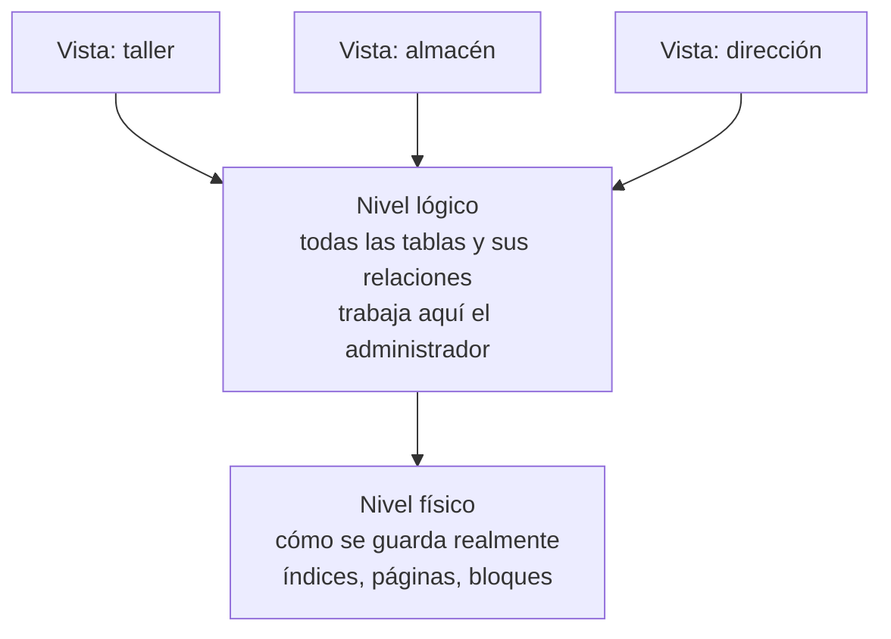

- **Físico**: el más bajo. Solo se toca para optimizar.
- **Lógico**: intermedio. Describe todos los datos con estructuras simples (tablas).
- **De vistas**: el más alto. Cada vista describe solo la parte de la BD que un usuario necesita.
  Simplifica el trabajo y aporta seguridad y privacidad.

---

## 3. Los SGBD

> Un SGBD es el software cuya finalidad es la gestión y el control de las bases de datos.

### 3.1 Evolución

| Etapa | Qué caracteriza |
|---|---|
| Años 50 | Cintas perforadas y magnéticas: solo acceso secuencial, proceso por lotes |
| Años 60-70 | Sistemas centralizados, terminales sin capacidad propia. Los programas dependen del nivel físico |
| Años 80 | SGBD relacionales. SQL se estandariza en 1986 (ANSI) y su uso se generaliza |
| Años 90 | BD distribuidas, arquitectura cliente/servidor, lenguajes de cuarta generación (4GL) |
| Actualidad | Multimedia, orientación a objetos, Internet, almacenes de datos, XML |

El modelo relacional se definió a principios de los 70, pero tardó una década en llegar al
mercado: al principio rendía peor que el jerárquico y el de red.

### 3.2 Objetivos y funcionalidades

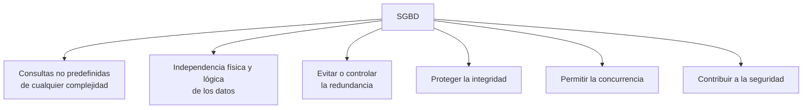

**Consultas no predefinidas.** Antes había que listar todo el fichero y seleccionar a mano, o
escribir un programa. El SGBD responde él mismo a una sentencia SQL.

**Independencia.** Los cambios físicos (añadir un índice) no obligan a tocar consultas ni
aplicaciones. Los cambios lógicos (añadir un atributo) no impiden ejecutar los procesos no
afectados.

**Redundancia.** El coste de almacenamiento importa poco hoy; el riesgo de perder la integridad al
actualizar, sí. El gestor debe permitir réplicas y **datos derivados** (resultado de cálculos sobre
otros datos), encargándose él de mantenerlos actualizados.

**Integridad.** Se protege con reglas de integridad y con copias de seguridad.

| Tipo de regla | Quién la define | Ejemplo |
|---|---|---|
| Restricción del modelo | Inherente al modelo, el gestor la incorpora | Dos filas no pueden tener la misma clave primaria |
| Restricción del usuario | El diseñador o el administrador | Un componente retirado no puede estar montado en un equipo |

**Concurrencia.** Dos técnicas:

- **Transacción**: conjunto de operaciones que se ejecutan como una unidad. O todas, o ninguna.
- **Bloqueo**: impedir el acceso a ciertos datos mientras una transacción los usa, para que las
  transacciones se ejecuten como si estuvieran aisladas.

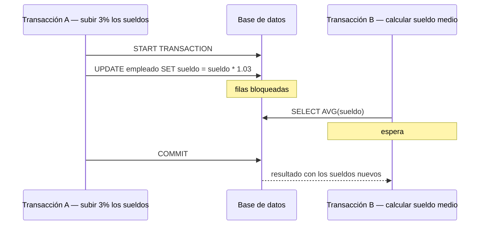

**Seguridad.** Autorizaciones a nivel de BD, de entidad, de atributo y de tipo de operación, sobre
usuarios identificados. Además, cifrado: penaliza el rendimiento, pero las contraseñas se cifran
siempre.

### 3.3 Lenguajes

El material clásico distingue dos tipos de lenguaje, **DDL** y **DML**. En la práctica actual, las
sentencias de SQL —que es un único lenguaje— se agrupan en cuatro sublenguajes:

| Sublenguaje | Para qué | Sentencias |
|---|---|---|
| **DDL** · definición de datos | Crear, modificar y borrar la estructura | `CREATE`, `ALTER`, `DROP` |
| **DML** · manipulación de datos | Consultar y modificar el contenido | `SELECT`, `INSERT`, `UPDATE`, `DELETE` |
| **DCL** · control de datos | Dar y quitar permisos | `GRANT`, `REVOKE` |
| **TCL** · control de transacciones | Confirmar o deshacer | `COMMIT`, `ROLLBACK`, `SAVEPOINT` |

En este RA basta con reconocerlas y saber a qué grupo pertenece cada una. Se escriben a partir del
RA3.

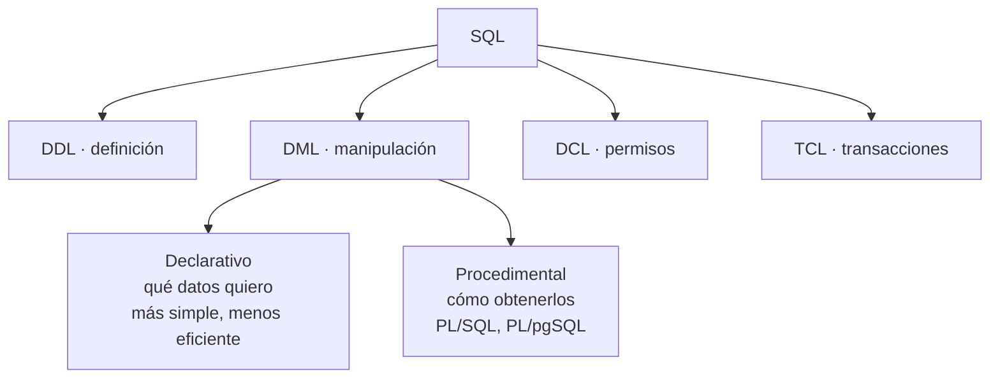

Desde lenguajes de programación externos hay dos vías de acceso: llamar a bibliotecas que
implementan estándares de conectividad (**ODBC**, **JDBC**), o alojar sentencias SQL dentro del
programa anfitrión.

### 3.4 Usuarios y administradores

| Tipo | Cómo interactúa |
|---|---|
| Usuario externo | A través de una aplicación hecha por otros. Quien saca dinero de un cajero |
| Usuario sofisticado | Directamente, escribiendo consultas en SQL |
| Programador de aplicaciones | Escribe los programas que usan los usuarios externos |
| Administrador (DBA) | Gestiona y controla: esquemas, permisos, copias, espacio, rendimiento |

Tareas del administrador: crear y administrar esquemas, gestionar la seguridad, hacer copias
periódicas, controlar el espacio en disco, vigilar la integridad, observar el rendimiento, asesorar
a programadores y usuarios, cambiar el diseño físico y resolver emergencias. Su responsabilidad
principal no es arreglar incidentes, sino evitarlos.

### 3.5 Componentes funcionales

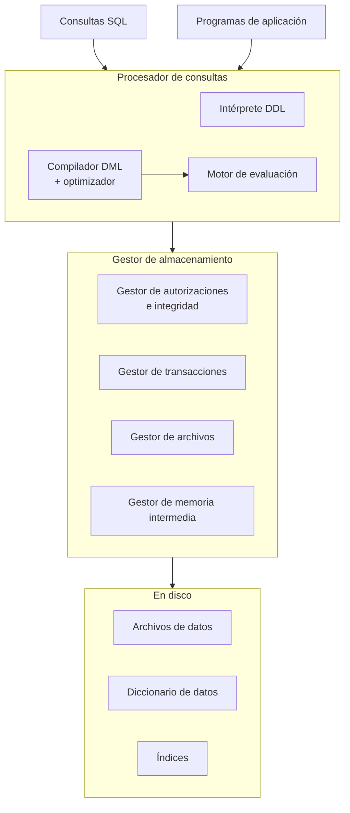

### 3.6 Diccionario de datos

Conjunto de **metadatos** con información sobre el contenido y la organización de la base de datos.
También se llama catálogo del sistema o repositorio de metadatos. Contiene:

- Definiciones del esquema.
- Descripción de tablas, campos, vistas, índices, funciones, procedimientos, disparadores.
- Restricciones de integridad referencial.
- Control de acceso: usuarios, roles, privilegios.
- Parámetros de ubicación del almacenamiento y estadísticas de uso.

Cada gestor lo implementa a su manera:

```sql
-- Oracle: vistas con prefijo USER_, ALL_ o DBA_
SELECT owner, object_name, object_type FROM ALL_OBJECTS;

-- MySQL y MariaDB: esquema INFORMATION_SCHEMA
SELECT table_name, table_type, engine
FROM information_schema.tables
WHERE table_schema = 'inventario';
```

---

## 4. Modelos de bases de datos

> Un modelo de datos es un conjunto de herramientas lógicas para describir los datos, sus
> interrelaciones, su significado y las restricciones que garantizan su coherencia.

Todo modelo aporta tres cosas: **estructuras de datos** (tablas, árboles), **reglas de integridad**
(tipos, dominios, claves) y **operaciones** (altas, bajas, modificaciones, consultas).

### 4.1 Arquitectura ANSI/SPARC (1975)

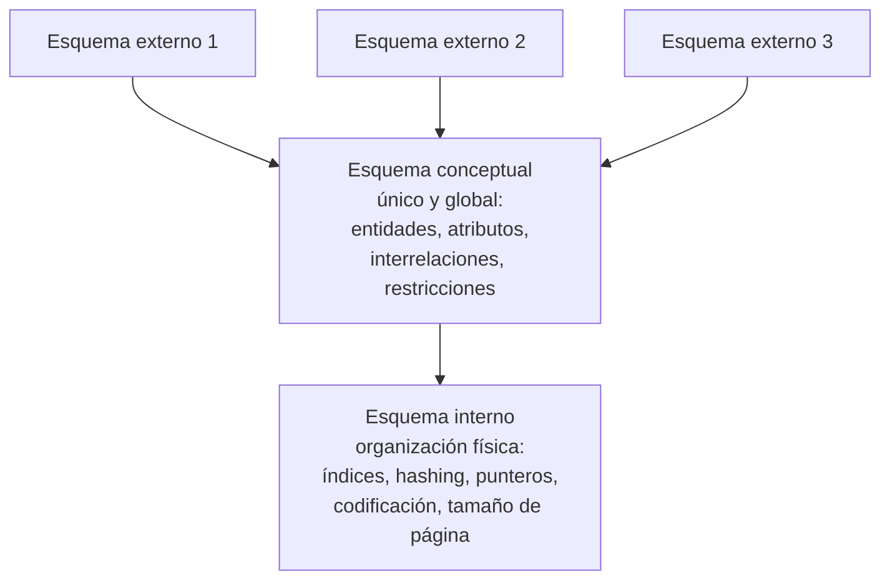

El **esquema** es la descripción de la estructura de la BD, y el SGBD lo necesita permanentemente
para funcionar. Un esquema externo puede renombrar atributos, definir datos derivados, presentar
una entidad como si fueran dos o varias como si fueran una.

### 4.2 Los modelos más comunes

**Jerárquico** (años 60). Árbol invertido: cada nodo padre tiene varios hijos, la raíz no tiene
padre, las hojas no tienen hijos. Las relaciones se establecen a nivel físico, con punteros a la
dirección del registro padre.

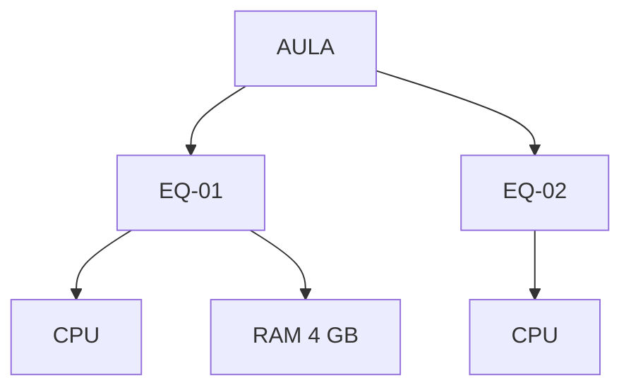

Rendimiento muy bueno hacia la raíz, pésimo en sentido inverso: obliga a recorrer todos los
registros. No evita la redundancia ni garantiza la integridad referencial: al borrar el padre, los
hijos quedan huérfanos. Gestores: IMS (IBM), Adabas (Software AG).

**En red** (años 70). Igual, pero un nodo puede tener **más de un padre**. Controla mejor la
redundancia, a costa de una administración compleja. Estándar CODASYL; gestor: IDMS.

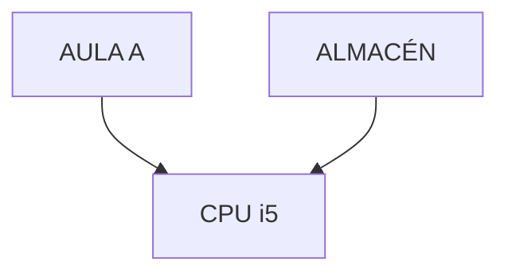

**Relacional** (Codd, 1970; comercial en los 80). Basado en la lógica de predicados y la teoría de
conjuntos. Un único elemento: la **relación** o tabla. Las interrelaciones se implementan con
**claves ajenas** que apuntan a la clave primaria de otra tabla.

Ventajas sobre los anteriores: evita la duplicidad de registros, vela por la integridad referencial
(impide o propaga en cascada borrados y modificaciones) y se limita al nivel lógico, lo que da
independencia física de los datos.

**Relacional con objetos y orientado a objetos.** El primero extiende el relacional admitiendo
tipos abstractos de datos. El segundo define la BD en términos de objetos, sus propiedades y sus
operaciones (**métodos**); los objetos con la misma estructura forman una **clase** y las clases se
organizan en jerarquías con herencia.

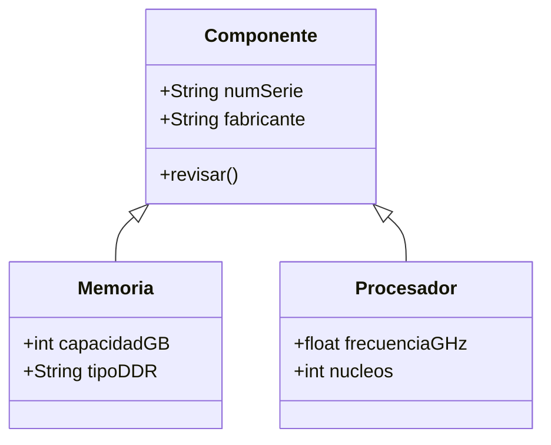

### 4.3 Nuevos modelos

Cuando hay que consultar millones de registros históricos para decidir, el relacional no responde
con eficiencia suficiente. De ahí:

- **Almacenes de datos** (*data warehouse*): réplicas elaboradas de los datos de la operativa
  diaria, con herramientas de extracción, transformación y carga.
- **BD multidimensionales**: optimizadas para procesamiento analítico en línea (**OLAP**). Los
  datos se organizan en **cubos**, donde cada dimensión es una perspectiva de consulta: por
  producto, por periodo, por población.
- **BD multivalor** (post-relacionales): los atributos guardan listas de valores. Lenguajes más
  cercanos al natural que SQL, pero sin estándar común.

### 4.4 NoSQL

El material del IOC es de 2011 y no llega aquí, pero el currículo pide reconocer los tipos de base
de datos según el modelo, y desde 2009 el mapa incluye los gestores **NoSQL**: nombre de conjunto
para lo que no es relacional. Nacen con la web a gran escala, con más datos y usuarios de los que
un solo servidor relacional podía atender y con datos que no encajan en tablas fijas.

El mismo dato, «EQ-04 está en el Taller y tiene un módulo de 8 GB DDR4 Crucial», en tres modelos:

**Relacional** · tablas relacionadas por claves:

| id_equipo | aula |
|---|---|
| EQ-04 | Taller |

| id_componente | id_equipo | tipo | fabricante | capacidad_gb |
|---|---|---|---|---|
| C-0117 | EQ-04 | RAM DDR4 | Crucial | 8 |

**Documental** · un documento JSON por equipo, con todo dentro:

```json
{
  "equipo": "EQ-04",
  "aula": "Taller",
  "componentes": [
    { "tipo": "RAM DDR4", "fabricante": "Crucial", "capacidad_gb": 8 }
  ]
}
```

**Clave-valor** · una clave y un valor, que el gestor no interpreta:

```text
equipo:EQ-04:aula   →  "Taller"
equipo:EQ-04:ram_gb →  8
```

Las cuatro familias:

| Familia | Cómo guarda | Para qué destaca | Ejemplos |
|---|---|---|---|
| **Documental** | Documentos JSON; cada uno puede tener campos distintos | Datos con estructura variable, catálogos, contenido web | MongoDB, CouchDB |
| **Clave-valor** | Pares clave → valor, a menudo en memoria | Velocidad: cachés, sesiones de usuario, colas | Redis, Valkey |
| **Columnar** (de columna ancha) | Filas con familias de columnas que pueden variar de una fila a otra, repartidas entre muchos servidores | Escrituras masivas: sensores, registros, mensajería | Cassandra, HBase |
| **Grafos** | Nodos y aristas con propiedades | Relaciones: redes sociales, rutas, recomendaciones | Neo4j |

| | Relacional | NoSQL |
|---|---|---|
| Esquema | Fijo: las tablas y columnas se definen antes de guardar | Flexible: cada documento o clave puede ser distinto |
| Integridad | El gestor la garantiza (claves ajenas, restricciones) | Normalmente la garantiza la aplicación |
| Transacciones | ACID | Depende del gestor; muchos priorizan velocidad y disponibilidad |
| Consulta | SQL, estándar | Lenguaje propio de cada gestor |
| Escala | Mejor en un servidor más grande (vertical) | Pensados para repartirse entre muchos servidores (horizontal) |
| Cuándo | Datos estructurados donde la coherencia importa: inventario, facturación, matrícula | Volumen enorme, estructura cambiante o velocidad extrema |

El inventario del reto es relacional porque su valor está en las relaciones (componente, modelo,
fabricante, equipo) y en que el gestor impida datos incoherentes.

### 4.5 Modelado con UML

Los diagramas de clases UML expresan lo mismo que los E/R en la parte estática de un sistema de
información.

| Diagrama E/R | Diagrama de clases UML |
|---|---|
| Entidad tipo | Clase: recuadro con nombre, atributos y operaciones |
| Interrelación binaria | Asociación: línea continua entre clases, con nombre o roles |
| Atributos de la interrelación | Recuadro adicional unido con línea discontinua |
| Cardinalidad `máx..mín` | Igual, pero la `n` se escribe `*` y las etiquetas van en el lado contrario |
| Generalización | Línea que va de la subclase a la superclase, con punta de flecha hueca |

En una generalización **solapada** cada subclase lleva su propia flecha; en una **disjunta**, las
líneas confluyen en una sola punta. Las interrelaciones de grado superior a 2 no se pueden
representar directamente en UML.

---

## 5. Ubicación de las bases de datos

Dos preguntas distintas que se confunden a menudo: **dónde está el gestor** (quién ejecuta el
software y cómo se llega a él) y **dónde están los datos** (en una máquina o repartidos).

### 5.1 Dónde está el gestor

| Tipo | Cómo funciona | Ventajas | Inconvenientes | Ejemplos |
|---|---|---|---|---|
| **Embebida** (local) | La base de datos es un fichero dentro de la aplicación; el gestor es una biblioteca del propio programa. No hay servidor | Cero instalación y cero administración | Un solo programa escribiendo a la vez; sin usuarios ni acceso por red | SQLite en cada móvil Android, en Firefox y en WhatsApp |
| **Cliente-servidor** (en servidor propio) | Un proceso servidor atiende por red a muchos clientes | Muchos usuarios a la vez, permisos, control total | Hay que instalarlo, mantenerlo, protegerlo y hacer copias | MariaDB del aula, PostgreSQL en 2.º |
| **En la nube** (DBaaS) | Un proveedor da el gestor como servicio; se paga por uso | Sin hardware propio; copias y alta disponibilidad incluidas | Coste continuo, dependencia del proveedor, datos fuera de casa (protección de datos) | Amazon RDS, Azure SQL, Google Cloud SQL, MongoDB Atlas |

### 5.2 Dónde están los datos

| Tipo | Qué significa | Ejemplo |
|---|---|---|
| **Centralizada** | Todos los datos en un único sitio | El MariaDB del aula |
| **Distribuida** | Los datos están repartidos entre varios servidores en sitios distintos, pero el usuario los ve como una sola base de datos | Una empresa con una sede en cada ciudad; cada sede guarda sus datos y se consultan juntos |
| Fragmentada | Distribuida donde cada servidor guarda una parte distinta | Los clientes de Aragón en Zaragoza, los de Cataluña en Barcelona |
| Replicada | Distribuida donde varios servidores guardan copia de los mismos datos | Un servidor principal y una réplica que toma el relevo si el principal cae (se monta en 2.º) |

Una base de datos distribuida gana disponibilidad —si cae un sitio, los demás siguen— y acerca los
datos a quien los usa; a cambio, mantener todas las copias coherentes es mucho más difícil. Los
apartados siguientes desarrollan esto con el detalle del material original.

### 5.3 Arquitecturas de los sistemas distribuidos

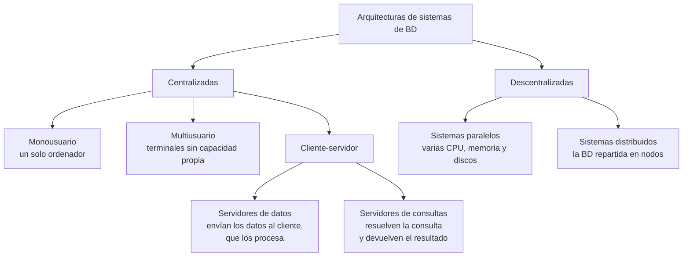

En cliente-servidor, la distinción es **lógica, no física**: un cliente puede pedir a varios
servidores, un servidor atender a muchos clientes, y ambos residir en la misma máquina. Los
servidores de consultas son los de mayor implantación.

**Sistemas paralelos.** Aumentan la velocidad de proceso y de E/S usando en paralelo CPU, memoria y
discos. Imprescindibles con BD del orden de terabytes o miles de transacciones por segundo. Redes
de interconexión: bus (pocos procesadores), malla (cada nodo conectado a los adyacentes), hipercubo
(menor retardo: cada elemento a log(n) nodos como máximo). Modelos: memoria compartida, discos
compartidos, sin compartición y jerárquico.

**Sistemas distribuidos.** Conjunto de BD parcialmente independientes, en ordenadores distintos, que
comparten un esquema común y coordinan las transacciones que acceden a datos remotos. No comparten
ni memoria ni discos.

| | Homogéneos | Heterogéneos |
|---|---|---|
| SGBD | El mismo en todos los nodos | Distinto en cada nodo |
| Acoplamiento | Fuerte, interacción sencilla | Más difícil, suele requerir conversiones |
| Actualizar el gestor | Afecta a todos los nodos | Cada nodo por separado |

El usuario no tiene que conocer dónde están ni cómo se organizan los datos: eso es la
**transparencia**. El administrador sí.

| Ventajas | Inconvenientes |
|---|---|
| Compartición con autonomía local | Mayor coste de desarrollo de software |
| Fiabilidad y disponibilidad ante caídas | Más posibilidad de errores: los nodos operan en paralelo |
| Consultas divisibles en subconsultas paralelas | Tiempo extra de intercambio de mensajes |

### 5.4 Diseño de la distribución

Objetivos: potenciar el **procesamiento local** (acercar los datos a quien más los usa), repartir
bien la **carga de trabajo** y controlar los **costes de almacenamiento**. Los dos primeros pueden
entrar en conflicto.

| Estrategia | Cuándo | Cómo |
|---|---|---|
| Ascendente (*bottom-up*) | Integrar BD preexistentes conservando su ubicación | Sintetizar los esquemas lógicos locales hasta el esquema global |
| Descendente (*top-down*) | BD y aplicaciones nuevas | Del análisis de requisitos al diseño conceptual, luego lógico con las decisiones de distribución |

Los sistemas que salen de un diseño ascendente suelen ser heterogéneos; en uno descendente conviene
optar por un sistema homogéneo.

### 5.5 Metodologías de distribución

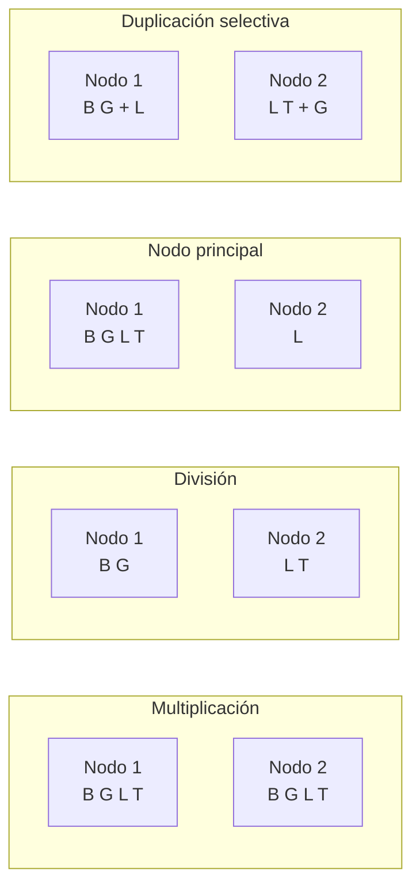

| Metodología | Ventaja | Inconveniente |
|---|---|---|
| Multiplicación · la BD entera en cada nodo | Consultas locales y muy rápidas; tolera caídas | Toda actualización va a todos los nodos: tráfico intenso. Multiplica el espacio |
| División · ninguna parte replicada | Actualizaciones simples; el espacio es el de una BD centralizada | Casi todas las consultas son globales. Si cae un nodo, se pierde su parte |
| Nodo principal · uno tiene la BD entera, los demás su parte | Potencia el proceso local, buena disponibilidad | Actualización y almacenamiento más caros que en centralizado |
| Duplicación en nodos seleccionados · ninguno la tiene entera, pero todo está duplicado | Como la anterior, con algo más de disponibilidad | Similares a la anterior |

### 5.6 Duplicación y fragmentación

- **Duplicación**: copias idénticas de una relación en varios nodos. Mejora disponibilidad y
  paralelismo; sobrecarga las actualizaciones, que deben mantener la consistencia de las réplicas.
- **Fragmentación**: dividir las relaciones en fragmentos que contengan toda la información
  necesaria para reconstruir la original.

Partiendo de una relación `PROVEEDOR(NIF, nombre, telefono, direccion, localidad)`:

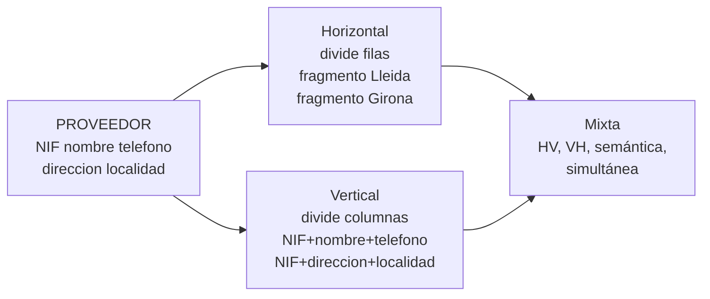

| Fragmentación | Qué divide | Condición |
|---|---|---|
| Horizontal | Las tuplas (filas), según los valores de uno o más atributos | Cada tupla en al menos un fragmento |
| Vertical | Los atributos (columnas) | Cada fragmento incluye la clave primaria, para poder recomponer |
| Mixta | Ambas, en un orden u otro | VH, HV, semántica y simultánea |

El **grado de fragmentación** va de cero (la unidad es la relación entera) al máximo (cada tupla o
cada atributo es un fragmento). Lo habitual es buscar un compromiso según el uso real.

### 5.7 Transacciones y protocolos de compromiso

Propiedades **ACID**, que todo SGBD debe garantizar:

| Propiedad | Qué significa |
|---|---|
| Atomicidad | O se hacen todas las operaciones de la transacción, o ninguna |
| Consistencia | Ejecutada aisladamente, la transacción conserva la consistencia de la BD |
| Aislamiento | Con concurrencia, cada transacción se ejecuta como si las demás no hubieran empezado o ya hubieran terminado |
| Durabilidad | Terminada con éxito, los cambios permanecen incluso ante fallos del sistema |

En un sistema distribuido, la atomicidad y el aislamiento de las transacciones globales son más
difíciles de garantizar. Para ello se usan **protocolos de compromiso**.

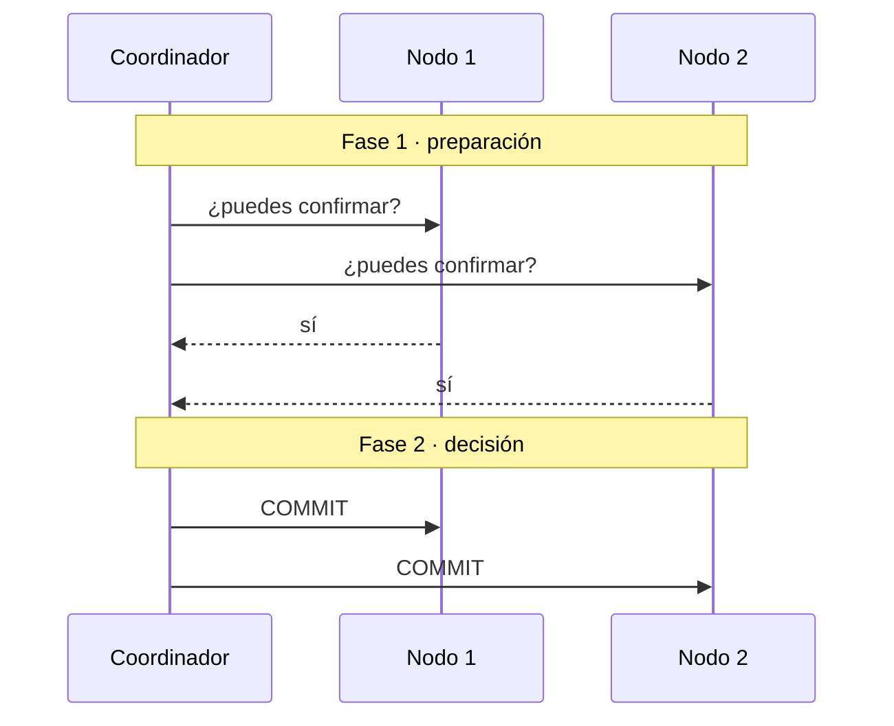

Si algún nodo responde que no, el coordinador cancela la transacción en todos.

El punto débil del **compromiso en dos fases** es el bloqueo: si el coordinador cae entre las dos
fases, los demás nodos no pueden cancelar por su cuenta —no saben si alguien ya confirmó— y esperan
indefinidamente. El **compromiso en tres fases** lo evita implicando nodos adicionales en la
decisión, pero añade tanta complejidad y sobrecarga que apenas se usa.

---

## 6. Clasificación de los SGBD

Un gestor se clasifica con varios criterios a la vez. No hay una única clasificación correcta: hay
que saber decir de un gestor dado qué es según cada criterio.

| Criterio | Clases |
|---|---|
| **Modelo de datos** | Jerárquico, en red, relacional, objeto-relacional, orientado a objetos, NoSQL (documental, clave-valor, columnar, grafos) |
| **Licencia** | Libre (se puede usar, estudiar, modificar y redistribuir); propietario (de pago, código cerrado); con edición gratuita limitada; de código disponible (se ve el código, pero la licencia restringe usos, sobre todo ofrecerlo como servicio) |
| **Ubicación y arquitectura** | Embebido, cliente-servidor, distribuido, en la nube |
| **Número de usuarios** | Monousuario (un usuario a la vez) o multiusuario |
| **Propósito** | General, o específico (series temporales, búsqueda de texto, geográfico) |
| **Tipo de carga** | Transaccional (OLTP: muchas operaciones pequeñas, como reservas o ventas) o analítico (OLAP: pocas consultas enormes sobre histórico, como informes) |

> **Los gestores concretos, en la investigación.** La tabla con MariaDB, PostgreSQL, SQLite,
> MongoDB, Redis y Oracle clasificados uno a uno no está aquí a propósito: es justo lo que pide la
> ficha de [`investigacion-1-gestores.md`](investigacion-1-gestores.md), y sale de la documentación
> oficial de cada gestor. Se publicará en este documento después de la puesta en común del 28 de
> septiembre.

---

## Glosario

| Término | Definición breve |
|---|---|
| ACID | Atomicidad, consistencia, aislamiento, durabilidad: las cuatro garantías de una transacción |
| Base de datos | Conjunto de ficheros de datos interrelacionados, sin redundancia innecesaria, accesible a varios usuarios y programas |
| Bloqueo | Impedir el acceso a unos datos mientras una transacción los usa |
| Clave | Atributo o conjunto de atributos que identifica inequívocamente una instancia |
| Concurrencia | Varios usuarios accediendo a los mismos datos a la vez |
| CSV | Fichero de texto con un registro por línea y campos separados por un carácter |
| Dato derivado | Dato almacenado que resulta de un cálculo sobre otros de la misma BD |
| DBaaS | Base de datos como servicio, en la nube |
| DDL · DML · DCL · TCL | Sentencias de definición, manipulación, control de permisos y control de transacciones |
| Diccionario de datos | Metadatos sobre el contenido y la organización de la BD: tablas, columnas, tipos, claves, usuarios |
| Dominio | Conjunto de valores válidos para un atributo |
| Embebida | Base de datos dentro de la propia aplicación, sin servidor |
| Esquema | Descripción de la estructura de una BD |
| Fragmentación | División de una relación en partes distribuidas entre nodos |
| Inconsistencia | Copias de un mismo dato que no coinciden |
| Independencia física / lógica | Cambiar el almacenamiento, o la estructura, sin tocar las aplicaciones |
| Índice | Estructura ordenada que permite localizar registros sin recorrerlo todo |
| Integridad | Que los datos cumplan las reglas: tipos, claves, referencias válidas |
| Metadatos | Datos que describen a otros datos |
| Modelo de datos | Forma de organizar y relacionar los datos: relacional, documental… |
| NoSQL | Gestores no relacionales: documentales, clave-valor, columnares, de grafos |
| Redundancia | Repetición indeseada de datos, con riesgo de perder integridad |
| Registro / campo | Implementación de una fila / de una columna en un fichero |
| SGBD | Software que crea, mantiene y controla el acceso a una base de datos |
| Transacción | Conjunto de operaciones que se ejecutan como una unidad |
| Transparencia | Que el usuario no necesite saber dónde están los datos ni cómo se organizan |
| Valor nulo | Ausencia de valor; distinto de cero y de cadena vacía |
| Vista | Descripción parcial de la BD adaptada a un usuario o grupo |

---

## Autoevaluación

Intenta contestar antes de leer la respuesta, que va en la cita debajo de cada pregunta. Son del
estilo de la prueba.

**1. Abres un CSV exportado de la hoja y la fila de EQ-02 tiene un campo más que las demás. ¿Qué ha pasado y cómo se evita?**

> Un campo contiene el carácter separador (`4GB DDR3 kingston; 2GB Samsung` con separador `;`) y no
> va entre comillas, así que se lee como dos campos. Se evita encerrando ese campo entre comillas o,
> mejor, no guardando dos datos en una celda.

**2. ¿Por qué un .xlsx no es un fichero de texto aunque dentro tenga XML?**

> Porque es un `.zip`: para leerlo hay que descomprimirlo e interpretar su formato con un programa.
> Abierto con un editor de texto sale ilegible.

**3. Un fichero de 2 millones de componentes está organizado de forma secuencial. ¿Qué cuesta encontrar uno por su número de serie? ¿Qué organización lo mejora?**

> En el peor caso hay que leer los 2 millones de registros. Una organización indexada (o directa por
> número de serie) permite ir al registro sin recorrer el fichero.

**4. Di cuatro problemas de guardar el inventario en una hoja y qué aporta el SGBD para cada uno.**

> Cualquier cuatro de la tabla del apartado 2.2. Por ejemplo: `4096MB` / `4 GB` / `4` → tipo
> numérico y unidad fija en la columna; reserva de `EQ-4` → clave ajena que rechaza equipos
> inexistentes; dos personas editando a la vez → control de concurrencia; no se puede ocultar el
> email → permisos por columna; copia a medias → copias consistentes.

**5. ¿A qué sublenguaje pertenecen GRANT, ALTER, DELETE y ROLLBACK?**

> `GRANT`: DCL. `ALTER`: DDL. `DELETE`: DML. `ROLLBACK`: TCL.

**6. ¿Qué guarda el diccionario de datos? Pon un ejemplo de algo que puedas saber consultándolo.**

> Metadatos: qué tablas hay, sus columnas, tipos, claves, restricciones, usuarios y permisos.
> Ejemplo: qué columnas tiene la tabla `EQUIPO` y de qué tipo es cada una, sin mirar los datos.

**7. Se va la luz a mitad de registrar un préstamo: la reserva se había creado pero el equipo no se había marcado como prestado. ¿Qué propiedad de las transacciones lo resuelve y qué hace el gestor al volver?**

> La atomicidad. Como la transacción no llegó a confirmarse, al arrancar el gestor la deshace usando
> el registro de transacciones: la reserva desaparece y los datos quedan como antes de empezar.

**8. Una empresa tiene una base de datos en Zaragoza y una copia exacta en Huesca que toma el relevo si Zaragoza cae. ¿Qué tipo de base de datos es según la ubicación?**

> Distribuida y replicada. Si cada sede guardara solo sus propios datos, sería fragmentada.

**9. Añades una columna a la tabla EQUIPO y la aplicación de préstamos, que no la usa, sigue funcionando. ¿Cómo se llama esa propiedad? ¿Qué habría pasado con un CSV y un script?**

> Independencia lógica de datos. Con un CSV, el script que leía los campos por posición habría leído
> columnas equivocadas: dependencia entre programa y datos.

**10. Distingue «mundo real», «mundo conceptual» y «mundo de las representaciones» con el inventario del aula.**

> Mundo real: los equipos y componentes que hay en el aula. Mundo conceptual: lo que decidimos que
> nos interesa de ellos (cada equipo tiene una CPU y varios módulos de RAM). Mundo de las
> representaciones: las tablas `EQUIPO` y `COMPONENTE` en MariaDB.

**11. ¿Qué diferencia hay entre el tipo de dato y el dominio de un atributo?**

> El tipo define un conjunto de valores y las operaciones admisibles sobre ellos. El dominio es el
> conjunto de valores válidos para ese atributo concreto, normalmente un subconjunto del tipo, y no
> define operaciones. `ram_gb` es de tipo entero; su dominio son `1, 2, 4, 8, 16, 32`.

---


> **Faltan tres preguntas.** Las de clasificar un gestor concreto —SQLite, MongoDB y Redis— se
> añaden después de la puesta en común del 28 de septiembre: ahora mismo resolverían la ficha de
> [`investigacion-1-gestores.md`](investigacion-1-gestores.md) de alguno de los equipos.

## Anexo · Tipos de datos

No es del RA1 (es RA3.c), pero se trabajó en la S1V y entra en la misma prueba.

| Tipo | Qué guarda | Operaciones | En MariaDB | Ejemplo |
|---|---|---|---|---|
| Texto | Letras, códigos, cualquier cosa que no se calcula | Comparar, ordenar alfabéticamente, buscar | `VARCHAR(n)`, `CHAR(n)`, `TEXT` | `Kingston`, `EQ-04`, `ST500DM002` |
| Entero | Números sin decimales | Sumar, contar, comparar | `INT`, `SMALLINT` | `8` (GB), `350` (W) |
| Decimal | Números con decimales exactos | Aritmética exacta | `DECIMAL(p,s)` | `3.20` (GHz), `49.90` (€) |
| Booleano | Sí o no | Filtrar | `BOOLEAN` | `prestable` |
| Fecha y hora | Un momento en el tiempo | Ordenar, restar, filtrar por periodo | `DATE`, `DATETIME` | `2026-09-21` |

Tres reglas que se vieron con la hoja del aula:

| Regla | Por qué | Ejemplo |
|---|---|---|
| Lo que parece número y no se calcula es texto | Si se guarda como número se pierden los ceros a la izquierda y no se puede operar con sentido | Código postal `04001`, teléfono, etiqueta `EQ-04`, número de serie |
| La unidad va en el nombre de la columna, no en el valor | `4 GB` es texto y no se puede sumar; `4096MB` y `4` mezclan unidades | Columna `ram_gb` con valores `8`, `6`, `4` |
| Desconocido no es cero | Un `0` en la fuente dice que no tiene potencia; si no se sabe, el valor es nulo (`NULL`) | Fuente de EQ-03: `NULL`, no `0` ni `?` |

Más detalles que conviene saber:

| Tema | Qué | Ejemplo |
|---|---|---|
| Decimal exacto o aproximado | `DECIMAL` guarda exactamente lo que se escribe: obligatorio para dinero. `FLOAT` y `DOUBLE` son aproximados: valen para medidas | `49.90` € en `DECIMAL(6,2)` |
| Booleano en MariaDB | `BOOLEAN` se guarda como un entero pequeño: `1` es sí, `0` es no | `prestable = 1` |
| Fechas | Siempre en formato ISO 8601, año-mes-día: no hay duda de si es día/mes o mes/día | `2026-09-21`, no `21/09/26` |
| Lista cerrada de valores | Un `ENUM` o, mejor, una tabla aparte con los valores posibles | Estado: `pendiente`, `enviado`, `entregado` |
| Orden del texto | El texto se ordena letra a letra, según una **colación** (las reglas de orden de un idioma): por eso `10` va antes que `9` si se guardan como texto | Etiquetas con ceros: `EQ-09` antes de `EQ-10` |
| Relleno con ceros | Con ancho fijo, el orden alfabético coincide con el numérico | `EQ-04`, no `EQ-4` |
| Qué unidad elegir | La más pequeña que evite decimales, y se convierte al mostrar | `ram_mb`, `frecuencia_mhz`, precio en céntimos |
| Número de serie | Puede llevar letras y no es único entre fabricantes: es texto, y como mucho clave alternativa | `ST500DM002`, `Z1D5K2XY` |
| Preguntar por un nulo | Cualquier comparación con `NULL` da «desconocido»: `fuente_w = NULL` no encuentra nada. Se pregunta con `IS NULL` | `WHERE fuente_w IS NULL` |
