# GBD · Teoría 2 · Modelo entidad/relación y modelo relacional

Teoría del RA2: cómo se diseña una base de datos. Primero el **diagrama entidad/relación**, que
dice qué hay que guardar; después su paso a **tablas**, el modelo relacional, que dice cómo se
organiza. Es lo que haréis con el inventario del reto.

Está pensada para leerla sola y para proyectarla en clase: cada concepto lleva su diagrama.

| Apartado | Qué | Se practica en |
|---|---|---|
| [1](#1--el-diagrama-er) | El diagrama E/R: entidad, atributo, relación, cardinalidad, clave | `ejercicios-er-1.md` |
| [2](#2--del-diagrama-a-las-tablas) | Del diagrama a las tablas: claves, notación, reglas 1 a 6, DrawDB | `ejercicios-er-1.md` |
| [3](#3--el-modelo-relacional) | El modelo relacional: vocabulario y reglas de integridad | `ejercicios-er-2.md` |
| [4](#4--lo-que-queda-del-diagrama-er) | Lo que queda del E/R: tipos de atributo, entidad débil, reflexivas, ternarias, 1:1, jerarquías | `ejercicios-er-2.md` |
| [5](#5--reglas-de-paso-a-tablas-7-a-11) | Reglas de paso a tablas 7 a 11 | `ejercicios-er-2.md`, `ejercicios-er-3-equipos/` |

**Para ampliar:** el material del IOC (en catalán, 2011), que tiene el profesor: unidad 2, *Model Entitat-Relació* (págs. 83–154), y unidad 3, *Model relacional
i normalització* (págs. 155–215). Al principio de cada apartado se indica qué parte amplía. La teoría
del RA1 (ficheros, gestores, modelos de bases de datos) está en
[`teoria-1-introduccion-bd.md`](teoria-1-introduccion-bd.md).

**Cómo leer los diagramas.** Los diagramas E/R de este documento siguen la notación de clase:
rectángulo para la entidad, rombo para la relación, óvalo para el atributo y `(mín,máx)` junto a la
entidad. La clave, que en papel se subraya, aquí lleva 🔑. Los diagramas de tablas usan la notación
de DrawDB, pata de gallo, explicada en el apartado 2.

---

## 1 · El diagrama E/R

*IOC, unidad 2, apartado 1 (págs. 89–108).*

El modelo entidad/relación lo propuso Peter Chen en 1976. Describe el mundo que queremos guardar con
tres piezas: **entidades** (las cosas), **atributos** (sus datos) y **relaciones** (cómo se unen).
No depende de ningún gestor: es un dibujo para pensar.

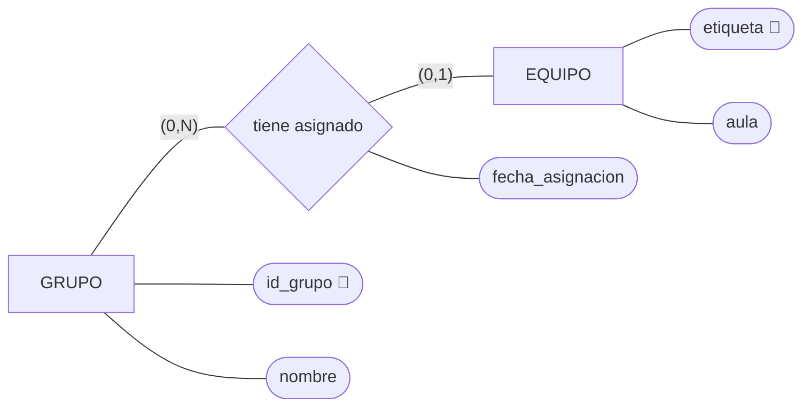
```mermaid
flowchart LR
  G[GRUPO] ---|"(0,N)"| R{tiene asignado}
  R ---|"(0,1)"| E[EQUIPO]
  G --- g1([id_grupo 🔑])
  G --- g2([nombre])
  E --- e1([etiqueta 🔑])
  E --- e2([aula])
  R --- r1([fecha_asignacion])
```

| Símbolo | Qué es | En el diagrama de arriba |
|---|---|---|
| Rectángulo | **Entidad**: una cosa de la que queremos guardar datos, y de la que hay muchas | GRUPO, EQUIPO |
| Óvalo | **Atributo**: un dato de la entidad | aula, nombre |
| Atributo subrayado (🔑) | **Clave**: el atributo (o atributos) que distingue una ocurrencia de todas las demás | etiqueta |
| Rombo | **Relación**: un verbo que une entidades | GRUPO *tiene asignado* EQUIPO |
| `(mín,máx)` junto a una entidad | **Cardinalidad**: en cuántas ocurrencias de la relación participa **una** ocurrencia de esa entidad | `(0,N)`, `(0,1)` |

### 1.1 Entidad y atributo

Se distingue la **entidad tipo** (EQUIPO, en general) de cada **ocurrencia** (el equipo `EQ-04`).
Cada atributo tiene un **dominio**: los valores que puede tomar (`aula` es un texto; `ram_gb`, un
entero de una lista corta).

**¿Atributo o entidad?** Es entidad si tiene datos propios además del nombre, si se relaciona con
otras cosas, o si hace falta controlar la lista de valores posibles. Si no, es atributo. La misma cosa
puede ser atributo en un diseño y entidad en otro: depende de las preguntas que tenga que contestar la
base de datos. No hay respuesta universal; hay decisiones justificadas.

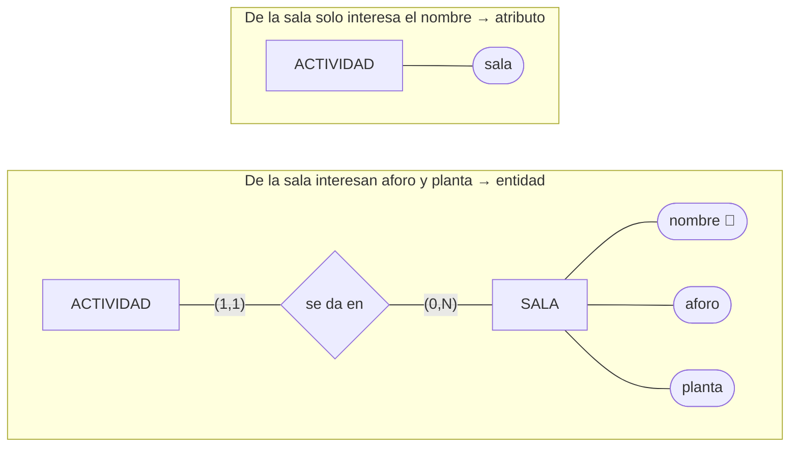
```mermaid
flowchart TB
  subgraph at["De la sala solo interesa el nombre → atributo"]
    direction LR
    A1[ACTIVIDAD] --- a1([sala])
  end
  subgraph en["De la sala interesan aforo y planta → entidad"]
    direction LR
    A2[ACTIVIDAD] ---|"(1,1)"| r{se da en} ---|"(0,N)"| S[SALA]
    S --- s1([nombre 🔑])
    S --- s2([aforo])
    S --- s3([planta])
  end
  at ~~~ en
```

### 1.2 Relación

Una relación es un **verbo** que une entidades. Se lee como una frase en los dos sentidos: «un
grupo *tiene asignados* equipos», «un equipo *está asignado a* un grupo». Si no se puede leer en voz
alta, está mal.

Cuando una misma entidad hace dos papeles distintos, cada papel es una relación propia, con su
nombre: un partido tiene un equipo **local** y un equipo **visitante**.

Un **atributo de relación** es un dato que no es de ninguna de las dos entidades, sino del hecho de
que estén relacionadas: la fecha en que se asignó un equipo a un grupo, las unidades de un producto
en un pedido. Si un atributo de relación parece que debería ser de una de las entidades, casi siempre
es que la cardinalidad está mal.

### 1.3 Cardinalidad

Para cada relación se hacen **dos preguntas**, una desde cada lado, pensando siempre en **una**
ocurrencia cualquiera:

> Un GRUPO, ¿con cuántos EQUIPOS como mínimo y como máximo? → `(0,N)`: puede no tener ninguno, puede tener muchos.
>
> Un EQUIPO, ¿con cuántos GRUPOS como mínimo y como máximo? → `(0,1)`: puede no estar asignado, y como mucho a uno.

La cardinalidad se escribe **junto a la entidad de la que habla**. Hay libros y webs que la ponen en
el extremo contrario; si buscáis por internet, fijaos en qué convenio usa cada uno.

| Mínimo | Significa |
|---|---|
| 0 | Participación **opcional**: puede existir sin participar en la relación |
| 1 | Participación **obligatoria**: no puede existir sin participar |

El **tipo de relación** sale de los dos máximos:

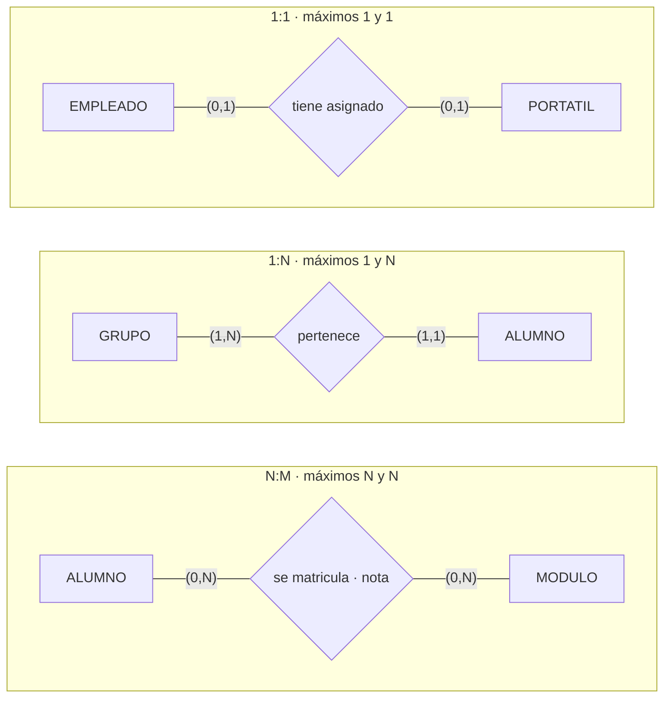
```mermaid
flowchart TB
  subgraph t1["1:1 · máximos 1 y 1"]
    direction LR
    E1[EMPLEADO] ---|"(0,1)"| x1{tiene asignado} ---|"(0,1)"| P1[PORTATIL]
  end
  subgraph t2["1:N · máximos 1 y N"]
    direction LR
    G2[GRUPO] ---|"(1,N)"| x2{pertenece} ---|"(1,1)"| A2[ALUMNO]
  end
  subgraph t3["N:M · máximos N y N"]
    direction LR
    A3[ALUMNO] ---|"(0,N)"| x3{se matricula · nota} ---|"(0,N)"| M3[MODULO]
  end
  t1 ~~~ t2 ~~~ t3
```

### 1.4 Clave

Una **clave** identifica cada ocurrencia sin posibilidad de confusión. Una buena clave es **única**,
**nunca falta**, **no cambia** con el tiempo y es **corta**. El nombre de una persona se repite; un
email cambia; un número de serie puede faltar. Cuando no hay ningún dato así, se inventa un código:
es lo que hacéis al etiquetar los equipos (`EQ-04`). En el apartado 2 están todos los tipos de clave.

### 1.5 Ejemplo: el almacén del aula

> En el almacén hay componentes sueltos. Cada componente es de un modelo (*Kingston KVR16N11/4*), y
> cada modelo lo hace un fabricante. Un componente puede estar montado en un equipo o guardado en una
> estantería. Y de cada componente queremos saber de qué equipo lo sacamos, aunque ahora esté montado
> en otro.

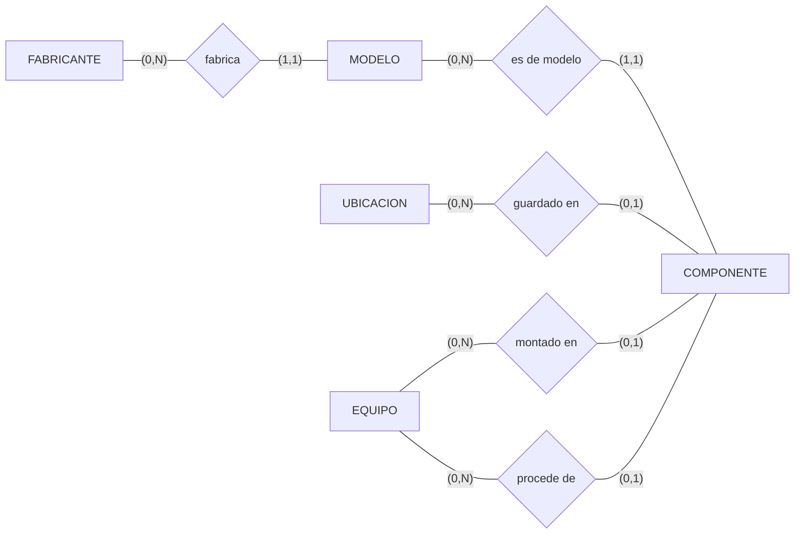
```mermaid
flowchart LR
  F[FABRICANTE] ---|"(0,N)"| r1{fabrica} ---|"(1,1)"| M[MODELO]
  M ---|"(0,N)"| r2{es de modelo} ---|"(1,1)"| C[COMPONENTE]
  U[UBICACION] ---|"(0,N)"| r3{guardado en} ---|"(0,1)"| C
  E[EQUIPO] ---|"(0,N)"| r4{montado en} ---|"(0,1)"| C
  E ---|"(0,N)"| r5{procede de} ---|"(0,1)"| C
```

| Lo que enseña | Dónde |
|---|---|
| «Kingston» se escribe una vez | FABRICANTE separado de MODELO |
| Un componente existe aunque no esté en ningún equipo | `(0,1)` en *montado en* |
| Dos relaciones entre las mismas entidades | *montado en* y *procede de*: con una sola, al mover un componente se pierde de dónde salió |
| Hay reglas que el diagrama no puede dibujar | *Guardado en* y *montado en* se excluyen: un componente está en un sitio o en el otro, no en los dos. Se apunta aparte como **restricción** |

### 1.6 Conceptos de los ejercicios 1 a 4

| Concepto | Qué es | Cómo se reconoce en un enunciado |
|---|---|---|
| **Atributo o entidad** | Ver 1.1 | «De la sala solo interesa el nombre» → atributo. «De cada sala, aforo y planta» → entidad |
| **Atributo de relación** | Ver 1.2 | «Cuántas unidades de cada producto hay **en un pedido**»: no es del producto ni del pedido |
| **Dato derivado** | Un dato que se calcula a partir de otros. No se guarda: si se guardara, se desincronizaría al cambiar los datos de los que sale | «El total se calcula», «el resultado se cuenta a partir de los goles» |
| **Dos relaciones entre las mismas entidades** | Ver 1.2 y 1.5 | Un partido tiene un equipo **local** y un equipo **visitante** |
| **Entidad débil** | Una entidad que solo se identifica dentro de otra. Ver 4.2 | «El tercer gol» solo significa algo dentro de un partido concreto |
| **Restricción no representable** | Una regla del enunciado que el diagrama no puede dibujar. Se escribe en una lista aparte, diciendo dónde se garantizaría | «Los dos equipos de un partido tienen que ser distintos» |

---

## 2 · Del diagrama a las tablas

*IOC, unidad 3, apartado 1.3 (págs. 180–192).*

El diagrama E/R describe **qué** hay que guardar. Las tablas describen **cómo** se guarda en un
gestor relacional como MariaDB. El paso de uno a otro es casi mecánico: se aplican siempre las
mismas reglas.

### 2.1 Vocabulario

| Término | Qué es | Del diagrama sale… |
|---|---|---|
| **Tabla** | Conjunto de filas con las mismas columnas | De cada entidad, y de algunas relaciones |
| **Fila** (registro, tupla) | Una ocurrencia: un equipo concreto | — |
| **Columna** (campo) | Un dato, con un tipo y un nombre | De cada atributo |
| **Dominio** | Los valores válidos de una columna: su tipo y sus límites | — |
| **Nulo** (`NULL`) | La columna está vacía para esa fila: no se sabe o no aplica | De las participaciones opcionales y los atributos no obligatorios |

### 2.2 Claves

Es lo más importante del paso a tablas.

| Clave | Qué es | Ejemplo |
|---|---|---|
| **Clave candidata** | Cualquier columna, o grupo de columnas, que no se repite nunca y sirve para identificar la fila | En SOCIO: `id_socio` y también `email` |
| **Clave primaria** (PK) | La candidata que se elige como identificador oficial. Nunca se repite y nunca es nula. Hay exactamente una por tabla | `id_socio` |
| **Clave alternativa** (UK, *unique*) | Una candidata que no se ha elegido como primaria. El gestor sigue impidiendo que se repita | `email` |
| **Clave natural** | Un dato que ya existía en el mundo real y es único | El nombre de un estudio, un ISBN |
| **Clave subrogada** | Un código inventado, sin significado, solo para identificar: `id_...`, normalmente un número que pone el gestor | `id_juego` |
| **Clave compuesta** | La formada por varias columnas juntas: ninguna es única por separado, la combinación sí | `(titulo, anio)`: hay dos *Doom*, pero no dos *Doom* de 1993 |
| **Clave ajena** (FK, *foreign key*) | Una columna que guarda la clave primaria de **otra** tabla. Es lo que une las tablas | `id_estudio` en la tabla JUEGO |

¿Natural o subrogada? Usa una natural solo si es seguro que existe siempre, nunca se repite y nunca
cambia. Ante la duda, subrogada, y la natural como alternativa.

La clave ajena es lo que da la **integridad referencial**: el gestor no deja guardar en
`JUEGO.id_estudio` un valor que no exista en `ESTUDIO`, ni borrar un estudio que tenga juegos. Es
lo que habría rechazado la reserva de `EQ-4` en la hoja del aula.

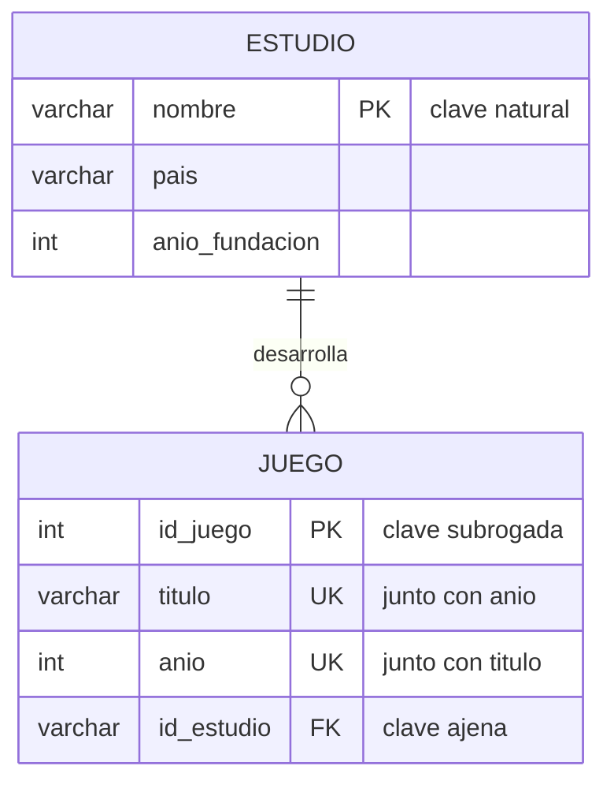
```mermaid
erDiagram
  ESTUDIO ||--o{ JUEGO : "desarrolla"
  ESTUDIO {
    varchar nombre PK "clave natural"
    varchar pais
    int anio_fundacion
  }
  JUEGO {
    int id_juego PK "clave subrogada"
    varchar titulo UK "junto con anio"
    int anio UK "junto con titulo"
    varchar id_estudio FK "clave ajena"
  }
```

### 2.3 Notación

En papel: la clave primaria **subrayada** y cada clave ajena con una **flecha** hacia la tabla a la
que apunta. En texto, que es como tienes que entregarlo:

```text
TABLA(columna_pk PK, columna, columna?, columna_fk FK → OTRA_TABLA)
      UK(columna_unica)
```

| Marca | Significa |
|---|---|
| `PK` | Clave primaria. Si es compuesta: `PK(a, b)` en la línea de abajo |
| `FK → TABLA` | Clave ajena que apunta a la clave primaria de TABLA |
| `?` al final del nombre | La columna admite nulo. Sin `?`, es obligatoria (`NOT NULL`) |
| `UK(…)` | Clave alternativa: el gestor impide que se repita |

### 2.4 Pata de gallo: cómo dibuja DrawDB

DrawDB no usa rombos: dibuja las tablas y las une con líneas que llevan la cardinalidad en los
extremos, en notación **pata de gallo** (*crow's foot*). Los diagramas de tablas de este documento
usan la misma notación.

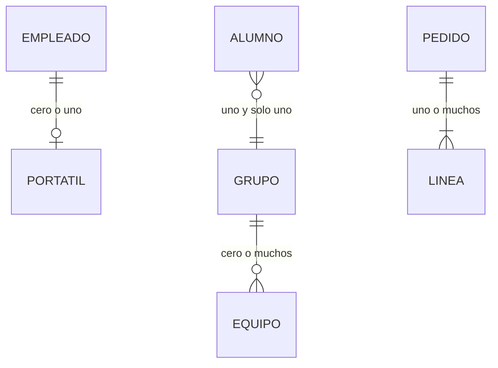
```mermaid
erDiagram
  EMPLEADO ||--o| PORTATIL : "cero o uno"
  GRUPO ||--o{ EQUIPO : "cero o muchos"
  PEDIDO ||--|{ LINEA : "uno o muchos"
  ALUMNO }o--|| GRUPO : "uno y solo uno"
```

| Extremo de la línea | Se lee |
|---|---|
| dos rayas: `──‖` | Uno y solo uno |
| círculo y raya: `──o‖` | Cero o uno |
| raya y pata de gallo: `──‖<` | Uno o muchos |
| círculo y pata de gallo: `──o<` | Cero o muchos |

El símbolo de dentro (círculo o raya) es el mínimo; el de fuera (raya o pata de gallo), el máximo.

Ojo: en pata de gallo la cardinalidad se dibuja en el extremo **contrario** al de la notación de
clase. `GRUPO ──(0,N)── EQUIPO` en clase se dibuja con la pata de gallo pegada a EQUIPO: «un grupo
tiene cero o muchos equipos» se lee de GRUPO hacia EQUIPO, y el símbolo va en la punta.

### 2.5 Las reglas 1 a 6

**Regla 1 · Cada entidad es una tabla.** Sus atributos son columnas; su clave es la clave primaria.
Los atributos derivados **no** se pasan: no se guardan.

**Regla 2 · Relación 1:N → clave ajena en el lado N.** La tabla de la entidad que participa como
mucho una vez (la que tiene máximo 1 en su cardinalidad) recibe una columna con la clave de la otra.
No se crea tabla nueva.

- Si esa entidad tiene **mínimo 1**, la clave ajena es obligatoria.
- Si tiene **mínimo 0**, la clave ajena admite nulo (`?`).
- Si la relación tiene atributos, van a la misma tabla que la clave ajena.

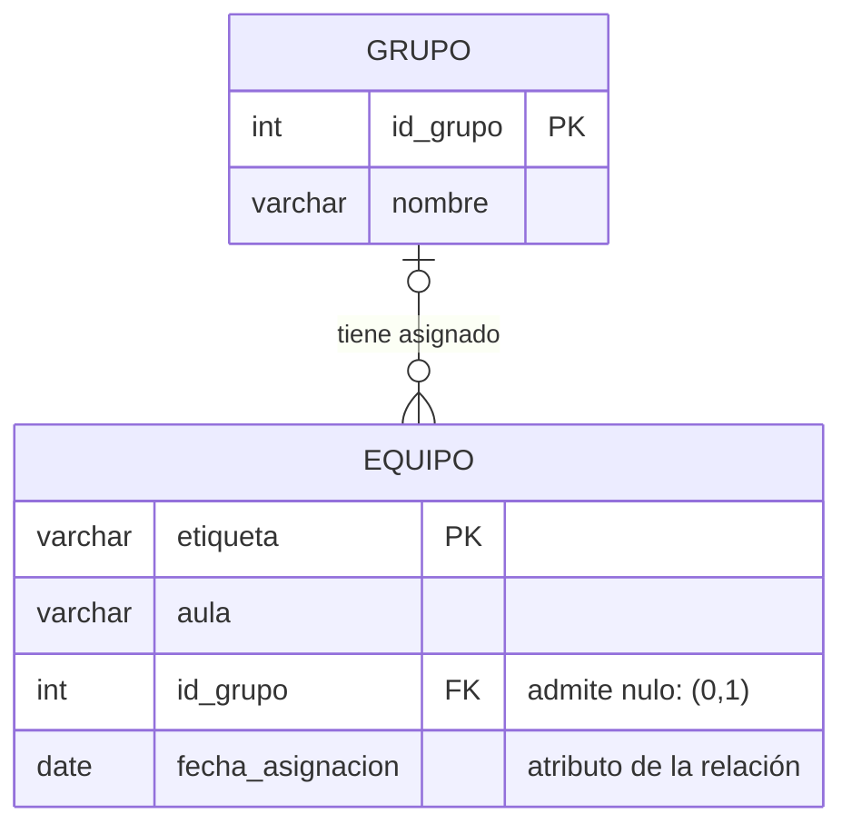
```mermaid
erDiagram
  GRUPO |o--o{ EQUIPO : "tiene asignado"
  GRUPO {
    int id_grupo PK
    varchar nombre
  }
  EQUIPO {
    varchar etiqueta PK
    varchar aula
    int id_grupo FK "admite nulo: (0,1)"
    date fecha_asignacion "atributo de la relación"
  }
```

¿Por qué en el lado N y no al revés? Porque un grupo tiene muchos equipos: si la clave fuera en
GRUPO, habría que poner varios equipos en una celda, que es justo el error de la hoja del aula.
Cada equipo, en cambio, apunta a un solo grupo.

**Regla 3 · Relación N:M → tabla nueva.** Su clave primaria es compuesta, formada por las claves
ajenas a las dos entidades. Los atributos de la relación son columnas de esa tabla. Se le pone un
nombre que diga qué guarda (INSCRIPCION, MATRICULA, LINEA_PEDIDO).

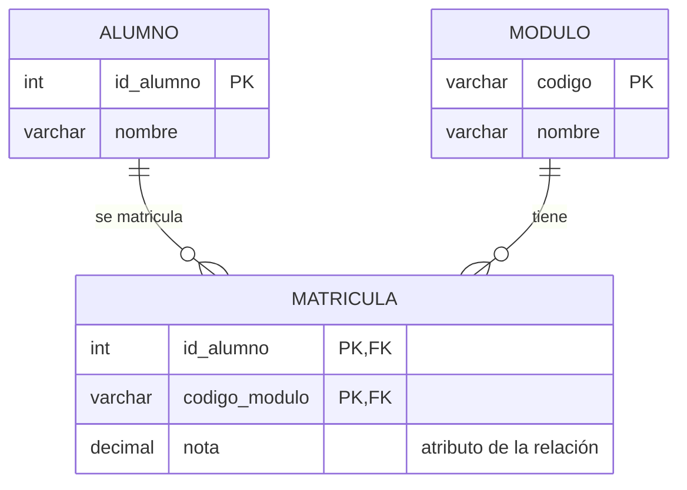
```mermaid
erDiagram
  ALUMNO ||--o{ MATRICULA : "se matricula"
  MODULO ||--o{ MATRICULA : "tiene"
  ALUMNO {
    int id_alumno PK
    varchar nombre
  }
  MATRICULA {
    int id_alumno PK, FK
    varchar codigo_modulo PK, FK
    decimal nota "atributo de la relación"
  }
  MODULO {
    varchar codigo PK
    varchar nombre
  }
```

Una N:M con muchos atributos o con vida propia (se crea, cambia de estado, se cierra) suele ser en
realidad una entidad: PEDIDO, RESERVA, PRÉSTAMO.

**Regla 4 · Relación 1:1 → clave ajena en uno de los dos lados, con UK.** Se pone en el lado que
participa obligatoriamente, para evitar nulos; si los dos son opcionales, en el que deje menos
nulos. El UK impide que dos filas apunten a la misma.

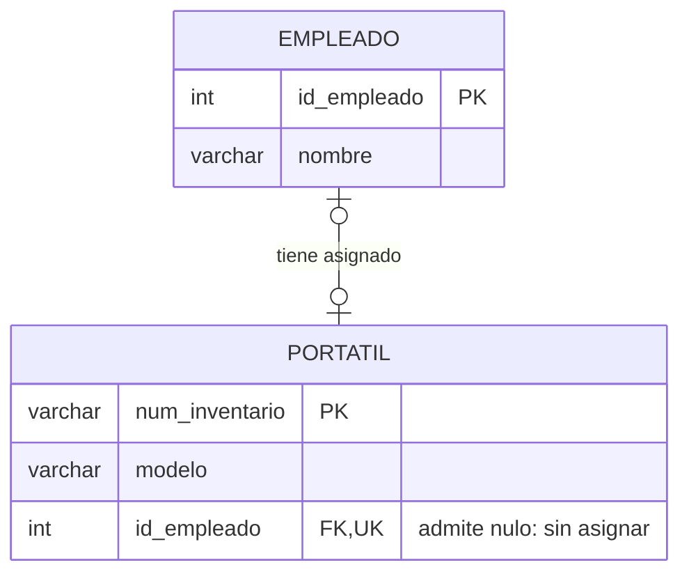
```mermaid
erDiagram
  EMPLEADO |o--o| PORTATIL : "tiene asignado"
  EMPLEADO {
    int id_empleado PK
    varchar nombre
  }
  PORTATIL {
    varchar num_inventario PK
    varchar modelo
    int id_empleado FK, UK "admite nulo: sin asignar"
  }
```

**Regla 5 · Entidad débil → su clave primaria es la clave de la fuerte más el discriminante.** La
clave de la fuerte es a la vez parte de la primaria y clave ajena. (Entidad débil: apartado 4.2.)

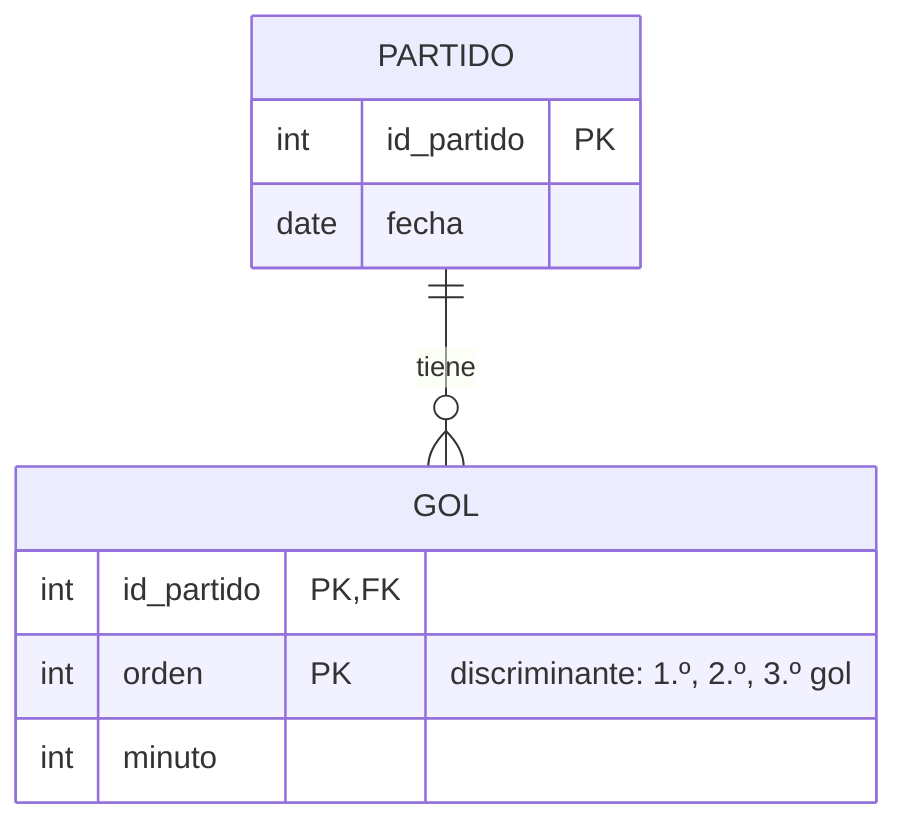
```mermaid
erDiagram
  PARTIDO ||--o{ GOL : "tiene"
  PARTIDO {
    int id_partido PK
    date fecha
  }
  GOL {
    int id_partido PK, FK
    int orden PK "discriminante: 1.º, 2.º, 3.º gol"
    int minuto
  }
```

**Regla 6 · Dos relaciones entre las mismas tablas → dos claves ajenas con nombres distintos.**
Cada una dice qué papel representa.

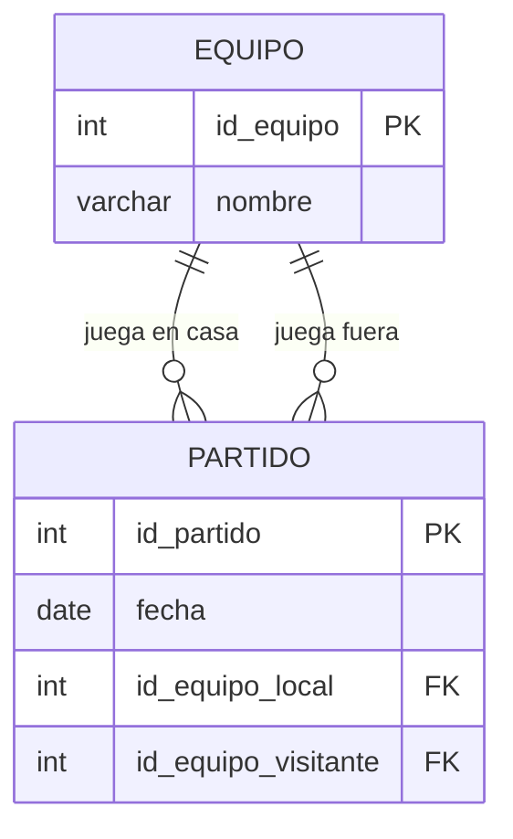
```mermaid
erDiagram
  EQUIPO ||--o{ PARTIDO : "juega en casa"
  EQUIPO ||--o{ PARTIDO : "juega fuera"
  EQUIPO {
    int id_equipo PK
    varchar nombre
  }
  PARTIDO {
    int id_partido PK
    date fecha
    int id_equipo_local FK
    int id_equipo_visitante FK
  }
```

### 2.6 Lo que las tablas no pueden expresar

Las tablas con sus claves garantizan tipos, unicidad y que las referencias existan. Hay cosas del
diagrama, y del enunciado, que se pierden por el camino, y hay que apuntarlas como restricciones:

| Se pierde | Ejemplo | Por qué |
|---|---|---|
| El mínimo 1 del lado «uno» de una 1:N | «Un pedido lleva al menos un producto» | La clave ajena está en la otra tabla: nada obliga a que exista alguna fila que apunte a este pedido |
| Reglas entre filas o entre tablas | «El jugador que marca es de uno de los dos equipos del partido» | Una clave ajena comprueba que el jugador existe, no de qué equipo es |
| Relaciones que se excluyen | «Un componente está montado o guardado, no las dos cosas» | Son dos claves ajenas independientes; que no estén las dos rellenas se pone aparte, con un `CHECK` |
| Reglas sobre valores | «La cantidad es mayor que 0» | Se puede poner con `CHECK` en el gestor, pero no se ve en el diagrama |

### 2.7 Ejemplo resuelto · Grupos, equipos y módulos

> En el instituto hay grupos (1ASIR, 1SMR…). A cada grupo se le asignan varios equipos del aula;
> un equipo puede estar asignado a un grupo o a ninguno, y se quiere saber desde qué fecha lo está.
> De cada equipo se guarda su etiqueta, que es única (`EQ-04`), y el aula. Los alumnos, de los que se
> guarda nombre y email, están en un único grupo, y se matriculan de varios módulos; de cada
> matrícula interesa la nota.

**Diagrama E/R:**

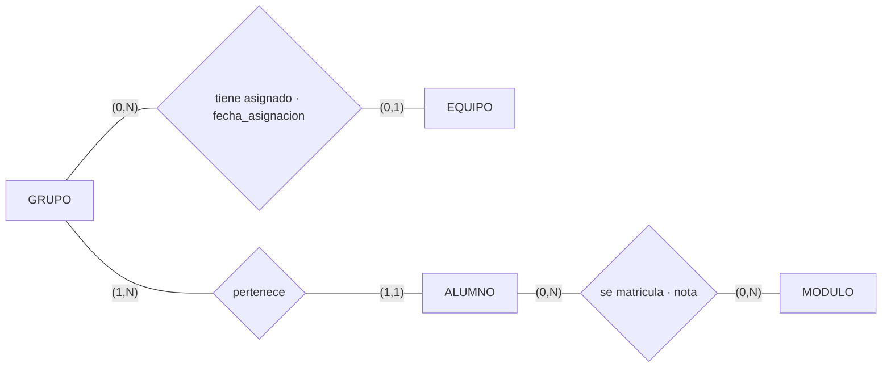
```mermaid
flowchart LR
  G[GRUPO] ---|"(0,N)"| r1{tiene asignado · fecha_asignacion} ---|"(0,1)"| E[EQUIPO]
  G ---|"(1,N)"| r2{pertenece} ---|"(1,1)"| A[ALUMNO]
  A ---|"(0,N)"| r3{se matricula · nota} ---|"(0,N)"| M[MODULO]
```

**Tablas, aplicando las reglas:**

```text
GRUPO(id_grupo PK, nombre)                                      UK(nombre)
EQUIPO(etiqueta PK, aula, id_grupo? FK → GRUPO, fecha_asignacion?)
ALUMNO(id_alumno PK, nombre, email, id_grupo FK → GRUPO)        UK(email)
MODULO(codigo PK, nombre)
MATRICULA(id_alumno FK → ALUMNO, codigo_modulo FK → MODULO, nota?)
          PK(id_alumno, codigo_modulo)
```

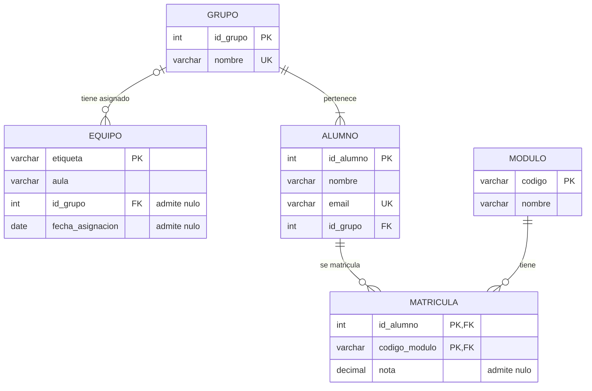
```mermaid
erDiagram
  GRUPO |o--o{ EQUIPO : "tiene asignado"
  GRUPO ||--|{ ALUMNO : "pertenece"
  ALUMNO ||--o{ MATRICULA : "se matricula"
  MODULO ||--o{ MATRICULA : "tiene"
  GRUPO {
    int id_grupo PK
    varchar nombre UK
  }
  EQUIPO {
    varchar etiqueta PK
    varchar aula
    int id_grupo FK "admite nulo"
    date fecha_asignacion "admite nulo"
  }
  ALUMNO {
    int id_alumno PK
    varchar nombre
    varchar email UK
    int id_grupo FK
  }
  MODULO {
    varchar codigo PK
    varchar nombre
  }
  MATRICULA {
    int id_alumno PK, FK
    varchar codigo_modulo PK, FK
    decimal nota "admite nulo"
  }
```

| Decisión | Regla |
|---|---|
| `etiqueta` es la clave de EQUIPO, sin subrogada | Regla 1. Es natural, única, siempre existe y no cambia |
| `id_grupo` va en EQUIPO, y admite nulo | Regla 2. EQUIPO tiene máximo 1; su mínimo es 0: puede no estar asignado |
| `fecha_asignacion` va en EQUIPO | Regla 2. Atributo de una 1:N: va con la clave ajena |
| `id_grupo` en ALUMNO es obligatorio | Regla 2. ALUMNO tiene `(1,1)`: todo alumno está en un grupo |
| MATRICULA es una tabla | Regla 3. ALUMNO–MODULO es N:M. La nota es de la matrícula, no del alumno ni del módulo |
| La clave de MATRICULA es compuesta | Regla 3. Un alumno no se matricula dos veces del mismo módulo |
| «Todo grupo tiene al menos un alumno» no aparece | El `(1,N)` de GRUPO se pierde. Va a la lista de restricciones |

Fíjate en que `id_grupo` aparece en tres tablas y **es la misma información**: la clave primaria de
GRUPO, copiada allí donde hace falta enlazar. Eso no es redundancia: es la única forma de relacionar
tablas.

---

## 3 · El modelo relacional

*IOC, unidad 3, apartados 1.1 y 1.2 (págs. 163–179).*

El diagrama E/R es el **modelo conceptual**: qué hay en el mundo que queremos guardar, sin pensar
en ningún gestor. El **modelo relacional** es el **modelo lógico**: cómo se organiza eso en tablas.
Lo propuso Edgar F. Codd en 1970 y es el que usan MariaDB, PostgreSQL, SQLite, Oracle o SQL Server.
El **modelo físico** es cómo lo guarda un gestor concreto en disco, con sus tipos y ficheros.

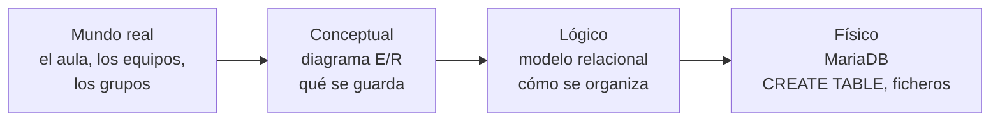
```mermaid
flowchart LR
  MR["Mundo real<br/>el aula, los equipos,<br/>los grupos"] --> C["Conceptual<br/>diagrama E/R<br/>qué se guarda"]
  C --> L["Lógico<br/>modelo relacional<br/>cómo se organiza"]
  L --> F["Físico<br/>MariaDB<br/>CREATE TABLE, ficheros"]
```

| Nivel | Depende de… |
|---|---|
| Conceptual | Nada: es un dibujo del negocio |
| Lógico | Del tipo de gestor (relacional), no del producto |
| Físico | Del producto concreto: MariaDB no guarda igual que PostgreSQL |

### 3.1 Vocabulario

Una tabla, con los nombres formales:

**EQUIPO** · grado 3 (columnas) · cardinalidad 4 (filas)

| etiqueta 🔑 | aula | id_grupo |
|---|---|---|
| EQ-01 | 1.12 | 1 |
| EQ-02 | 1.12 | 1 |
| EQ-03 | 1.12 | 2 |
| EQ-04 | Taller | *nulo* |

| Término formal | Término de todos los días | Qué es |
|---|---|---|
| **Relación** | Tabla | Conjunto de filas con las mismas columnas. Ojo: «relación» aquí **no** es el rombo del E/R |
| **Tupla** | Fila, registro | Una ocurrencia concreta: `EQ-03, 1.12, 2` |
| **Atributo** | Columna, campo | Un dato con nombre: `aula` |
| **Dominio** | Tipo y valores válidos | Los valores que puede tomar un atributo: `entero entre 1 y 64`, `DDR3, DDR4 o DDR5` |
| **Grado** | Número de columnas | EQUIPO tiene grado 3 |
| **Cardinalidad** | Número de filas | Cambia cada vez que se inserta o se borra. No confundir con la cardinalidad `(mín,máx)` del E/R |
| **Esquema** | La cabecera | Nombre de la tabla y sus columnas: `EQUIPO(etiqueta PK, aula, id_grupo)` |
| **Instancia** (extensión) | El contenido | Las filas que hay ahora mismo |

### 3.2 Propiedades de una tabla relacional

Una hoja de cálculo no cumple ninguna de estas. Una tabla, todas:

1. **No hay dos filas iguales.** Por eso toda tabla tiene clave primaria.
2. **Cada celda tiene un solo valor** (valor atómico). Nada de `2x4GB` ni `WD 1TB, Kingston SSD`.
3. **Todos los valores de una columna son del mismo dominio.** Nada de `4096MB`, `4 GB` y `4` en la
   misma columna.
4. **El orden de las filas no importa**, y el de las columnas tampoco. No hay «la fila 3»: hay «la
   fila cuya clave es `EQ-03`».

### 3.3 Reglas de integridad

Son las reglas que el gestor hace cumplir solo, sin programar nada:

| Regla | Qué dice | Qué rechaza el gestor |
|---|---|---|
| **Integridad de entidad** | La clave primaria nunca es nula y nunca se repite | Dar de alta un segundo `EQ-04`, o un equipo sin etiqueta |
| **Integridad referencial** | Una clave ajena o es nula o vale lo mismo que alguna clave primaria de la tabla a la que apunta | Guardar `EQ-4` en un componente si no existe el equipo `EQ-4` |
| **Integridad de dominio** | Cada valor pertenece al dominio de su columna | Guardar `ocho` en una columna entera, o `-2` si hay un `CHECK (capacidad_gb > 0)` |

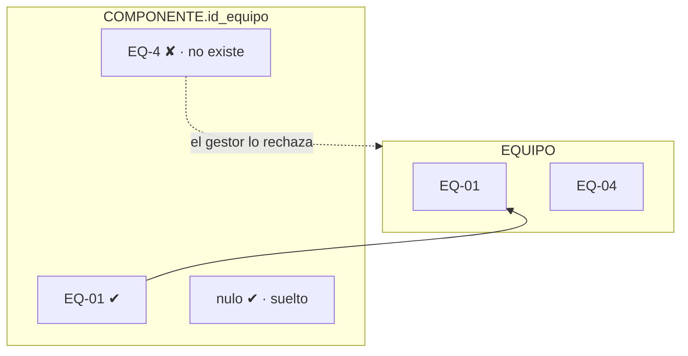
```mermaid
flowchart TB
  subgraph EQ["EQUIPO"]
    direction LR
    e1["EQ-01"]
    e4["EQ-04"]
  end
  subgraph CO["COMPONENTE.id_equipo"]
    direction LR
    c1["EQ-01 ✔"]
    c2["nulo ✔ · suelto"]
    c3["EQ-4 ✘ · no existe"]
  end
  c1 --> e1
  c3 -. "el gestor lo rechaza" .-> EQ
  EQ ~~~ CO
```

¿Y si se borra un equipo que tiene componentes montados? Se decide al crear la clave ajena:

| Opción | Qué pasa con los componentes | Cuándo tiene sentido |
|---|---|---|
| `RESTRICT` (lo normal) | El gestor **no deja** borrar el equipo mientras tenga componentes | Casi siempre: obliga a desmontar antes |
| `SET NULL` | Los componentes se quedan con `id_equipo` a nulo: pasan a estar sueltos | Si la clave ajena admite nulo y «suelto» es un estado válido |
| `CASCADE` | Se borran también los componentes | Solo en entidades débiles: si se borra un partido, se borran sus goles |

---

## 4 · Lo que queda del diagrama E/R

*IOC, unidad 2: apartados 1.1.3–1.1.6 (atributos, págs. 93–96), 1.2.2–1.2.4 (grado y
reflexivas, págs. 99–106), 1.3 (entidades débiles, págs. 106–108), 2.2.1 (especialización, págs.
126–133) y 3.1.3 (binarias o ternarias, pág. 145).*

### 4.1 Tipos de atributo

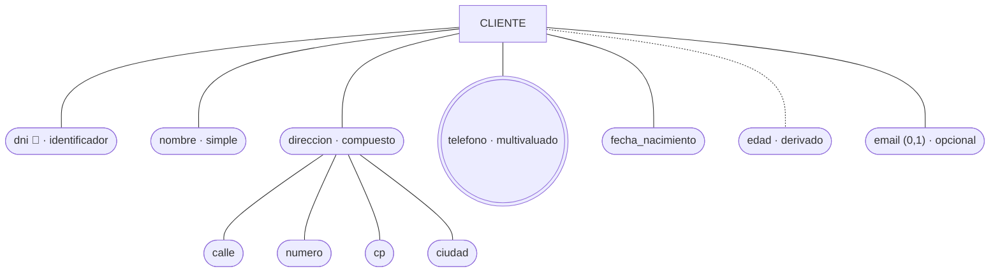
```mermaid
flowchart TB
  C[CLIENTE] --- dni([dni 🔑 · identificador])
  C --- nom([nombre · simple])
  C --- dir([direccion · compuesto])
  dir --- ca([calle])
  dir --- nu([numero])
  dir --- cp([cp])
  dir --- ci([ciudad])
  C --- tel((("telefono · multivaluado")))
  C --- fn([fecha_nacimiento])
  C -.- ed([edad · derivado])
  C --- em(["email (0,1) · opcional"])
```

| Tipo | Qué es | Cómo se dibuja en clase | Ejemplo |
|---|---|---|---|
| **Simple** | No se descompone | Elipse | `nombre` |
| **Compuesto** | Está formado por otros atributos que interesan por separado | Elipse de la que cuelgan otras elipses | `direccion` = calle + número + CP + ciudad |
| **Monovaluado** | Un solo valor por ocurrencia | Elipse | `fecha_nacimiento` |
| **Multivaluado** | Puede tener varios valores para la misma ocurrencia | Doble elipse | Los teléfonos de un cliente |
| **Obligatorio / opcional** | Si puede quedarse sin valor | Opcional: se anota `(0,1)` junto a la elipse | `email` si el cliente no quiere darlo |
| **Derivado** | Se calcula a partir de otros. No se guarda | Elipse de línea discontinua | `edad`, a partir de `fecha_nacimiento` |
| **Identificador** | La clave | Subrayado | `dni` |

¿Compuesto o simple? Depende de las preguntas. Si alguna pregunta necesita «clientes de Huesca»,
la ciudad tiene que estar aparte. Si la dirección solo se imprime en una etiqueta, basta un texto.

### 4.2 Entidad fuerte y entidad débil

Una **entidad débil** depende de otra (la **fuerte**). Hay dos formas de depender, y conviene no
confundirlas:

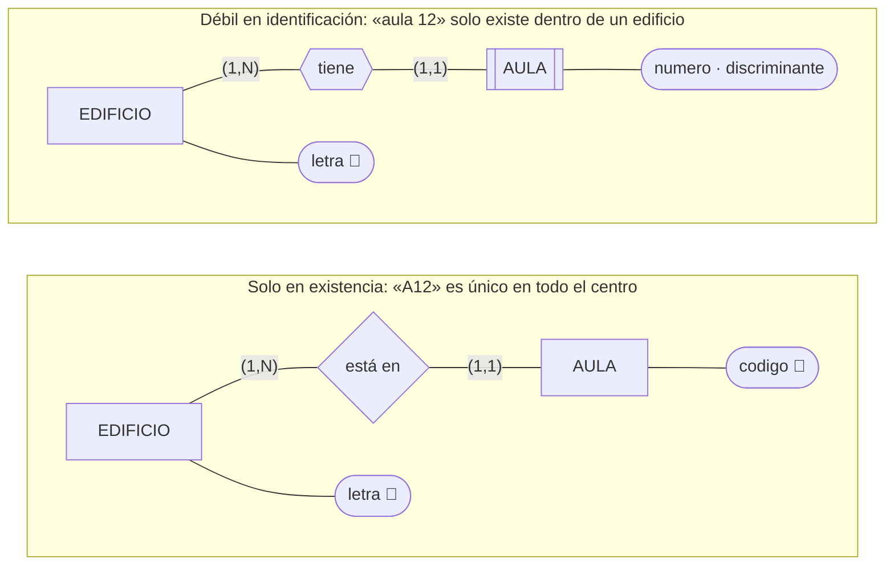
```mermaid
flowchart TB
  subgraph id["Débil en identificación: «aula 12» solo existe dentro de un edificio"]
    direction LR
    E1[EDIFICIO] ---|"(1,N)"| r1{{tiene}} ---|"(1,1)"| A1[[AULA]]
    E1 --- e1([letra 🔑])
    A1 --- a1([numero · discriminante])
  end
  subgraph ex["Solo en existencia: «A12» es único en todo el centro"]
    direction LR
    E2[EDIFICIO] ---|"(1,N)"| r2{está en} ---|"(1,1)"| A2[AULA]
    E2 --- e2([letra 🔑])
    A2 --- a2([codigo 🔑])
  end
  id ~~~ ex
```

| Dependencia | Qué significa | Ejemplo | Cómo se dibuja | Clave en tablas |
|---|---|---|---|---|
| **En existencia** | No puede existir sin la otra, pero se identifica sola | Una línea de pedido con su propio `id_linea`; un empleado siempre está en un departamento | Rectángulo normal. El `(1,1)` en la cardinalidad ya lo dice | Su propia PK. La clave ajena, obligatoria |
| **En identificación** | No se puede identificar sin la otra: su clave solo tiene sentido dentro de la fuerte | El «aula 12» solo tiene sentido diciendo de qué edificio; el «episodio 3» solo dentro de una temporada | **Doble rectángulo** y **doble rombo** (relación identificadora; en los diagramas de este documento, hexágono). El **discriminante** subrayado con línea discontinua | PK = clave de la fuerte + discriminante (regla 5) |

Toda dependencia en identificación lo es también en existencia. Al revés, no.

### 4.3 Relaciones: grado y tipo

El **grado** es cuántas entidades une la relación. El **tipo** (1:1, 1:N, N:M) sale de los máximos,
como en el apartado 1.3.

| Grado | Nombre | Ejemplo |
|---|---|---|
| 1 | **Reflexiva** (unaria, recursiva) | Un EMPLEADO *es jefe de* otros EMPLEADOS |
| 2 | Binaria | Todas las del apartado 1 |
| 3 | **Ternaria** | Un PROFESOR *imparte* un MÓDULO a un GRUPO |

**Reflexiva.** La entidad se relaciona consigo misma. Como las dos puntas llegan al mismo
rectángulo, en cada línea se escribe el **papel** (rol) que hace esa ocurrencia: *jefe* y
*subordinado*, *seguidor* y *seguido*, *requisito* y *requerido*. Las dos preguntas de siempre se
hacen una por papel:

> Un empleado, **como jefe**, ¿a cuántos empleados dirige? → `(0,N)`
>
> Un empleado, **como subordinado**, ¿cuántos jefes tiene? → `(0,1)`: la directora no tiene

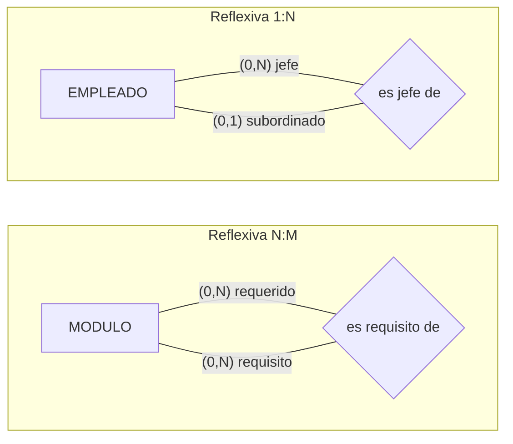
```mermaid
flowchart TB
  subgraph n1["Reflexiva 1:N"]
    direction LR
    E[EMPLEADO] ---|"(0,N) jefe"| R1{es jefe de}
    R1 ---|"(0,1) subordinado"| E
  end
  subgraph nm["Reflexiva N:M"]
    direction LR
    M[MODULO] ---|"(0,N) requerido"| R2{es requisito de}
    R2 ---|"(0,N) requisito"| M
  end
  n1 ~~~ nm
```

Puede ser 1:1 (*es la continuación de*, entre tomos de una saga), 1:N (*es jefe de*) o N:M
(*sigue a*, *es requisito de*).

**Ternaria.** Un hecho que solo tiene sentido con las tres entidades a la vez. Para sacar la
cardinalidad de una entidad se **fijan las otras dos** y se pregunta por ella:

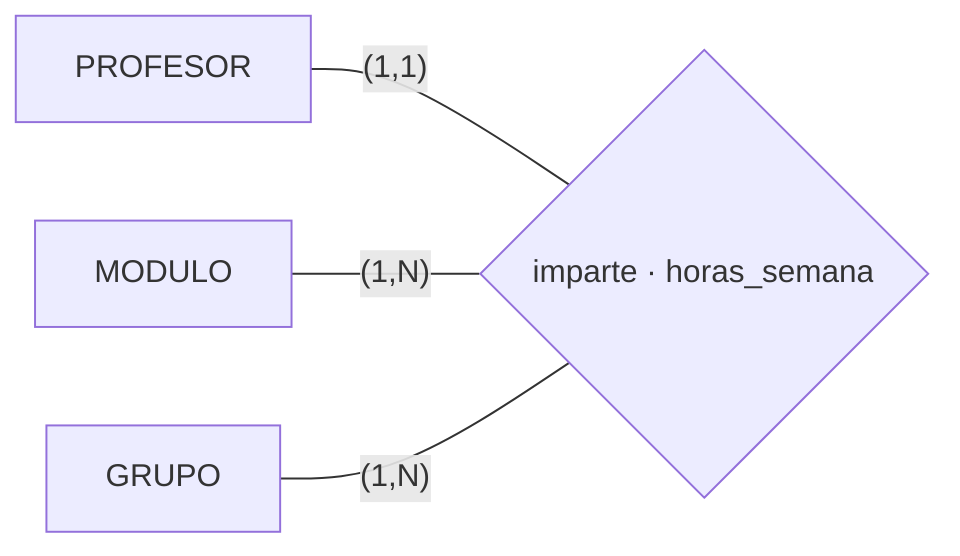
```mermaid
flowchart LR
  P[PROFESOR] ---|"(1,1)"| I{imparte · horas_semana}
  M[MODULO] ---|"(1,N)"| I
  G[GRUPO] ---|"(1,N)"| I
```

| Fijo | Pregunto | Respuesta | Se escribe junto a |
|---|---|---|---|
| un módulo y un grupo | ¿cuántos profesores? | uno | PROFESOR `(1,1)` |
| un profesor y un grupo | ¿cuántos módulos? | varios | MODULO `(1,N)` |
| un profesor y un módulo | ¿cuántos grupos? | varios | GRUPO `(1,N)` |

¿Por qué no tres relaciones binarias? Porque se pierde información. Si Ana da BD y Redes, Ana está
en 1A y en 1B, y BD se da en 1A y en 1B, con tres binarias no se sabe si Ana da Redes en 1A. La
ternaria guarda el trío completo.

**1:1.** Máximo 1 en los dos lados. Antes de dejarla así, pregúntate si no son la misma entidad: si
las dos tienen `(1,1)` y nunca existen por separado, suelen serlo. Si alguna tiene mínimo 0, se
mantienen separadas: un portátil puede estar sin asignar, un empleado puede no tener portátil.

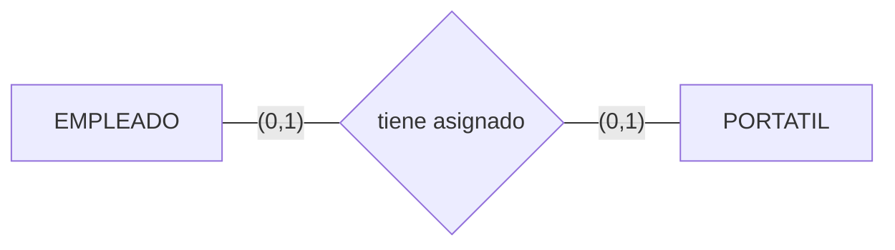
```mermaid
flowchart LR
  E[EMPLEADO] ---|"(0,1)"| R{tiene asignado} ---|"(0,1)"| P[PORTATIL]
```

### 4.4 Jerarquías: generalización y especialización

Cuando hay varias clases de una misma cosa, cada una con atributos propios, se dibuja un
**supertipo** con lo común y **subtipos** con lo particular, unidos por un triángulo *es un* (en los
diagramas de este documento, trapecio). Los subtipos heredan los atributos y la clave del supertipo.

```mermaid
flowchart TB
  C[COMPONENTE] --- h[/"es un · total, exclusiva"\]
  h --- R[RAM]
  h --- D[DISCO]
  h --- U[CPU]
  C --- a1([id_componente 🔑])
  C --- a2([fabricante])
  C --- a3([estado])
  R --- r1([capacidad_gb])
  R --- r2([tipo_memoria])
  D --- d1([capacidad_gb])
  D --- d2([tecnologia])
  U --- u1([nucleos])
  U --- u2([frecuencia_ghz])
```

Se clasifican con dos preguntas:

| Pregunta | Sí | No |
|---|---|---|
| ¿Toda ocurrencia del supertipo es de algún subtipo? | **Total**: no hay componentes «de ningún tipo» | **Parcial**: hay empleados que no son ni técnicos ni comerciales |
| ¿Puede una ocurrencia ser de dos subtipos a la vez? | **Solapada**: una persona puede ser alumna y monitora | **Exclusiva**: un componente es RAM o disco, no las dos cosas |

```mermaid
flowchart TB
  E[EMPLEADO] --- h[/"es un · parcial, exclusiva"\]
  h --- T[TECNICO]
  h --- C[COMERCIAL]
  E --- n["administración y dirección:<br/>ni técnicos ni comerciales"]
```

Solo merece jerarquía si los subtipos tienen **atributos o relaciones propios**. Si solo cambia el
nombre del tipo, basta un atributo `tipo`.

### 4.5 Resumen de símbolos

| En papel | En los diagramas de este documento | Significa |
|---|---|---|
| Rectángulo | Rectángulo | Entidad fuerte |
| Doble rectángulo | Rectángulo de doble borde | Entidad débil (en identificación) |
| Rombo | Rombo | Relación |
| Doble rombo | Hexágono | Relación identificadora, entre la débil y su fuerte |
| Rombo con las dos líneas a la misma entidad, con papeles | Igual | Relación reflexiva |
| Rombo con tres líneas | Igual | Relación ternaria |
| Elipse / doble elipse / discontinua | Óvalo / círculo doble / línea discontinua | Atributo / multivaluado / derivado |
| Elipse con elipses colgando | Igual | Atributo compuesto |
| Subrayado / subrayado discontinuo | 🔑 / «discriminante» | Clave / discriminante de la débil |
| Triángulo *es un* | Trapecio *es un* | Jerarquía, con `(total/parcial, exclusiva/solapada)` |

---

## 5 · Reglas de paso a tablas 7 a 11

*IOC, unidad 3, apartados 1.3.2–1.3.4 (págs. 182–192).*

Las reglas 1 a 6 están en el apartado 2.5: entidad → tabla, 1:N → clave ajena en el lado N, N:M →
tabla nueva, 1:1 → clave ajena con UK, débil → clave de la fuerte más discriminante, dos relaciones
→ dos claves ajenas con nombre de papel.

**Regla 7 · Reflexiva 1:N → clave ajena a la propia tabla.** Se nombra con el papel, nunca con el
nombre de la tabla: `id_jefe`, no `id_empleado2`. Admite nulo si el mínimo es 0 (la directora).
Una reflexiva 1:1 es lo mismo con `UK` en la clave ajena.

```text
EMPLEADO(id_empleado PK, nombre, id_jefe? FK → EMPLEADO)
```

```mermaid
erDiagram
  EMPLEADO |o--o{ EMPLEADO : "es jefe de"
  EMPLEADO {
    int id_empleado PK
    varchar nombre
    int id_jefe FK "admite nulo"
  }
```

**Regla 8 · Reflexiva N:M → tabla nueva con dos claves ajenas a la misma tabla.** Cada una con el
nombre de su papel; la clave primaria es la pareja.

```text
REQUISITO(codigo_modulo FK → MODULO, codigo_requisito FK → MODULO)
          PK(codigo_modulo, codigo_requisito)
```

```mermaid
erDiagram
  MODULO ||--o{ REQUISITO : "exige"
  MODULO ||--o{ REQUISITO : "es requisito en"
  MODULO {
    varchar codigo PK
    varchar nombre
  }
  REQUISITO {
    varchar codigo_modulo PK, FK
    varchar codigo_requisito PK, FK
  }
```

**Regla 9 · Ternaria → tabla nueva con tres claves ajenas.** La clave primaria la forman las claves
ajenas de las entidades con **máximo N**. La de una entidad con máximo 1 va en la tabla pero fuera
de la clave primaria, porque las otras dos ya la determinan. Si las tres tienen máximo N, la clave
primaria son las tres.

```text
IMPARTE(id_profesor FK → PROFESOR, codigo_modulo FK → MODULO, id_grupo FK → GRUPO, horas_semana)
        PK(codigo_modulo, id_grupo)          ← PROFESOR tiene máximo 1
```

```mermaid
erDiagram
  PROFESOR ||--o{ IMPARTE : "imparte"
  MODULO ||--o{ IMPARTE : "se imparte"
  GRUPO ||--o{ IMPARTE : "recibe"
  IMPARTE {
    int id_profesor FK "fuera de la PK: máximo 1"
    varchar codigo_modulo PK, FK
    int id_grupo PK, FK
    int horas_semana
  }
```

**Regla 10 · Atributos especiales.**

| Atributo | En tablas |
|---|---|
| Compuesto | Se guardan sus componentes como columnas: `calle`, `numero`, `cp`, `ciudad`. El atributo «dirección» desaparece |
| Multivaluado | **Tabla nueva**: la clave de la entidad + el valor, las dos en la clave primaria |
| Derivado | No se guarda (regla 1) |
| Opcional | La columna admite nulo: `email?` |

```mermaid
erDiagram
  CLIENTE ||--|{ TELEFONO_CLIENTE : "tiene"
  CLIENTE {
    char dni PK
    varchar nombre
    varchar calle "compuesto: dirección"
    varchar numero
    char cp
    varchar ciudad
    date fecha_nacimiento "la edad no se guarda"
    varchar email "opcional: admite nulo"
  }
  TELEFONO_CLIENTE {
    char dni PK, FK
    varchar telefono PK "multivaluado"
  }
```

¿Por qué el multivaluado no puede ser `telefono1`, `telefono2`, `telefono3`? Porque alguien tendrá
cuatro, la mayoría tendrá columnas vacías, y la pregunta «¿de quién es este teléfono?» obliga a
mirar tres columnas.

**Regla 11 · Jerarquía → tres opciones.**

| Opción | Tablas | Ventaja | Inconveniente |
|---|---|---|---|
| **A · Una tabla para todo** | `COMPONENTE(id PK, fabricante, estado, tipo, capacidad_gb?, tipo_memoria?, tecnologia?, nucleos?, frecuencia_ghz?)` | Una sola tabla; consultas sencillas | Muchos nulos. El gestor no impide que una RAM tenga núcleos |
| **B · Supertipo + una tabla por subtipo** | La del diagrama de abajo | Sin nulos; cada subtipo tiene sus columnas obligatorias; las relaciones comunes apuntan a COMPONENTE | Hay que juntar dos tablas para ver una RAM completa |
| **C · Solo los subtipos** | `RAM(id PK, fabricante, estado, capacidad_gb, tipo_memoria)`, igual para DISCO y CPU | Sin nulos, una tabla por consulta de un tipo | Lo común se repite. «Todos los componentes averiados» son tres consultas. Solo vale si es total y exclusiva |

Por defecto, **B**. La clave primaria de cada subtipo es a la vez clave ajena al supertipo: es una
1:1. Si la jerarquía es exclusiva, el `tipo` del supertipo dice en qué subtipo mirar.

```mermaid
erDiagram
  COMPONENTE ||--o| RAM : "es"
  COMPONENTE ||--o| DISCO : "es"
  COMPONENTE ||--o| CPU : "es"
  COMPONENTE {
    int id_componente PK
    varchar fabricante
    varchar estado
    varchar tipo "RAM, DISCO o CPU"
  }
  RAM {
    int id_componente PK, FK
    int capacidad_gb
    varchar tipo_memoria
  }
  DISCO {
    int id_componente PK, FK
    int capacidad_gb
    varchar tecnologia
  }
  CPU {
    int id_componente PK, FK
    int nucleos
    decimal frecuencia_ghz
  }
```

### 5.1 Lo que sigue sin caber

Las jerarquías y las reflexivas traen restricciones nuevas que ni el diagrama ni las tablas
garantizan:

| Restricción | Ejemplo |
|---|---|
| Nadie se relaciona consigo mismo | Un empleado no es su propio jefe; un módulo no es requisito de sí mismo |
| Sin ciclos | A jefe de B, B jefe de C, C jefe de A |
| Exclusiva | Un mismo `id_componente` no puede estar en RAM y en DISCO a la vez (opción B) |
| Total | Todo COMPONENTE tiene su fila en algún subtipo |
| Coherencia en la ternaria | El profesor que imparte un módulo es de su departamento |

---

Última actualización: 25 de septiembre de 2026.
